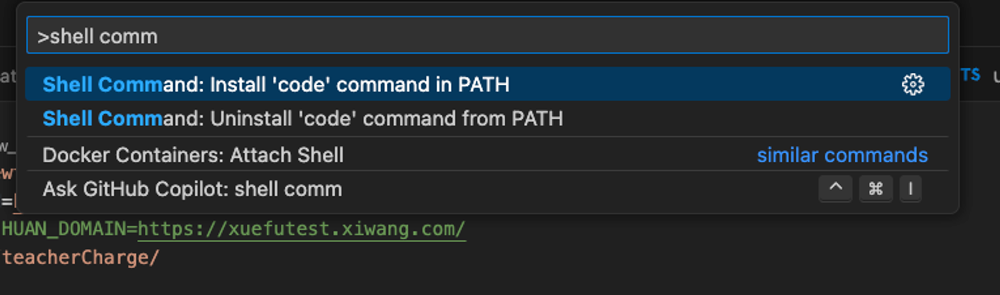
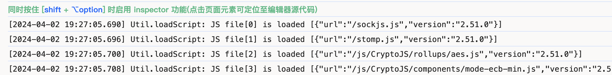

这篇文章系统解析了 code-inspector 的实现与应用。从插件接入、IDE 配置，到源码架构与 Webpack/Vite 工具链开发，再到通过 Web Components 渲染插件页面，逐步展示了完整的实现流程。同时也探讨了前端项目的多种管理方式，并通过源码拆解，揭示了从打点记录、启动服务到快速打开 IDE 的核心原理，帮助更好地理解和应用这一工具。
<!--more-->

# code-inspector实现解析

- [目录]
    - [1. 什么是code-inspector](notion://www.notion.so/majiaao/code-inspector-c7310cfd161e40bba0dc0c2ce7555fb2#1-%E4%BB%80%E4%B9%88%E6%98%AFcode-inspector)
    - [2. 通过本次分享你可能会收获到什么](notion://www.notion.so/majiaao/code-inspector-c7310cfd161e40bba0dc0c2ce7555fb2#2-%E9%80%9A%E8%BF%87%E6%9C%AC%E6%AC%A1%E5%88%86%E4%BA%AB%E4%BD%A0%E5%8F%AF%E8%83%BD%E4%BC%9A%E6%94%B6%E8%8E%B7%E5%88%B0%E4%BB%80%E4%B9%88)
    - [3. 如何接入code-inspector](notion://www.notion.so/majiaao/code-inspector-c7310cfd161e40bba0dc0c2ce7555fb2#3-%E5%A6%82%E4%BD%95%E6%8E%A5%E5%85%A5code-inspector)
        - [3.1 项目安装构建插件](notion://www.notion.so/majiaao/code-inspector-c7310cfd161e40bba0dc0c2ce7555fb2#3-1-%E9%A1%B9%E7%9B%AE%E5%AE%89%E8%A3%85%E6%9E%84%E5%BB%BA%E6%8F%92%E4%BB%B6)
        - [3.2 IDE环境配置](notion://www.notion.so/majiaao/code-inspector-c7310cfd161e40bba0dc0c2ce7555fb2#3-2-IDE%E7%8E%AF%E5%A2%83%E9%85%8D%E7%BD%AE)
        - [3.3 Dev环境使用](notion://www.notion.so/majiaao/code-inspector-c7310cfd161e40bba0dc0c2ce7555fb2#3-3-Dev%E7%8E%AF%E5%A2%83%E4%BD%BF%E7%94%A8)
    - [4. code-inspector源码解析](notion://www.notion.so/majiaao/code-inspector-c7310cfd161e40bba0dc0c2ce7555fb2#4-code-inspector%E6%BA%90%E7%A0%81%E8%A7%A3%E6%9E%90)
        - [4.1 项目架构](notion://www.notion.so/majiaao/code-inspector-c7310cfd161e40bba0dc0c2ce7555fb2#4-1-%E9%A1%B9%E7%9B%AE%E6%9E%B6%E6%9E%84)
        - [4.2 多仓库维护方式](notion://www.notion.so/majiaao/code-inspector-c7310cfd161e40bba0dc0c2ce7555fb2#4-2-%E5%A4%9A%E4%BB%93%E5%BA%93%E7%BB%B4%E6%8A%A4%E6%96%B9%E5%BC%8F)
            - [4.2.1 Multi-Repo](notion://www.notion.so/majiaao/code-inspector-c7310cfd161e40bba0dc0c2ce7555fb2#4-2.1-Multi-Repo)
            - [4.2.2 Mono-Repo](notion://www.notion.so/majiaao/code-inspector-c7310cfd161e40bba0dc0c2ce7555fb2#4-2.2-Mono-Repo)
            - [4.2.3 Git submodule](notion://www.notion.so/majiaao/code-inspector-c7310cfd161e40bba0dc0c2ce7555fb2#4-2.3-Git-submodule)
        - [4.3 code-inspector是如何渲染出的插件页面](notion://www.notion.so/majiaao/code-inspector-c7310cfd161e40bba0dc0c2ce7555fb2#4-3-code-inspector%E6%98%AF%E5%A6%82%E4%BD%95%E6%B8%B2%E6%9F%93%E5%87%BA%E7%9A%84%E6%8F%92%E4%BB%B6%E9%A1%B5%E9%9D%A2)
        - [4.4 Webpack、Vite Plugin及loader开发](notion://www.notion.so/majiaao/code-inspector-c7310cfd161e40bba0dc0c2ce7555fb2#4-4-Webpack%E3%80%81Vite-Plugin%E5%8F%8Aloader%E5%BC%80%E5%8F%91)
            - [4.4.1 Webpack Plugin开发](notion://www.notion.so/majiaao/code-inspector-c7310cfd161e40bba0dc0c2ce7555fb2#4-4.1-Webpack-Plugin%E5%BC%80%E5%8F%91)
            - [4.4.2 Webpack loader开发](notion://www.notion.so/majiaao/code-inspector-c7310cfd161e40bba0dc0c2ce7555fb2#4-4.2-Webpack-loader%E5%BC%80%E5%8F%91)
        - [4.5 code-inspector功能实现](notion://www.notion.so/majiaao/code-inspector-c7310cfd161e40bba0dc0c2ce7555fb2#4-5-code-inspector%E5%8A%9F%E8%83%BD%E5%AE%9E%E7%8E%B0)
            - [4.5.1 步骤1：项目安装构建插件](notion://www.notion.so/majiaao/code-inspector-c7310cfd161e40bba0dc0c2ce7555fb2#4-5.1-%E6%AD%A5%E9%AA%A41%EF%BC%9A%E9%A1%B9%E7%9B%AE%E5%AE%89%E8%A3%85%E6%9E%84%E5%BB%BA%E6%8F%92%E4%BB%B6)
            - [4.5.2 步骤2：打点记录源码地址](notion://www.notion.so/majiaao/code-inspector-c7310cfd161e40bba0dc0c2ce7555fb2#4-5.2-%E6%AD%A5%E9%AA%A42%EF%BC%9A%E6%89%93%E7%82%B9%E8%AE%B0%E5%BD%95%E6%BA%90%E7%A0%81%E5%9C%B0%E5%9D%80)
            - [4.5.3 步骤3：后端服务，启动！](notion://www.notion.so/majiaao/code-inspector-c7310cfd161e40bba0dc0c2ce7555fb2#4-5.3-%E6%AD%A5%E9%AA%A43%EF%BC%9A%E5%90%8E%E7%AB%AF%E6%9C%8D%E5%8A%A1%EF%BC%8C%E5%90%AF%E5%8A%A8%EF%BC%81)
            - [4.5.4 步骤4：注入挂载WebComponent](notion://www.notion.so/majiaao/code-inspector-c7310cfd161e40bba0dc0c2ce7555fb2#4-5.4-%E6%AD%A5%E9%AA%A44%EF%BC%9A%E6%B3%A8%E5%85%A5%E6%8C%82%E8%BD%BDWebComponent)
    - [5. 头脑风暴](https://www.notion.so/code-inspector-c7310cfd161e40bba0dc0c2ce7555fb2?pvs=21)

# 1. 什么是code-inspector

**code-inspector官方文档：**

[https://inspector.fe-dev.cn/en/](https://inspector.fe-dev.cn/en/)

# 2. 通过本次分享你可能会收获到什么

- **前端代码的管理方式**
- **Web-Components**
- **Webpack、Vite插件及babel工具链**
- **code-inspector的实现源码解析**

# 3. 如何接入code-inspector

## 3-1 项目安装构建插件

```jsx
const { codeInspectorPlugin } = require('code-inspector-plugin');

module.exports = () => ({
  plugins: [
    codeInspectorPlugin({
      bundler: 'webpack',
    }),
  ],
});
```

```jsx
import { defineConfig } from 'vite';
import { codeInspectorPlugin } from 'code-inspector-plugin';

export default defineConfig({
  plugins: [
    codeInspectorPlugin({
      bundler: 'vite',
    }),
  ],
});
```

## 3-2 IDE环境配置

以VsCode为例，执行shell命令，添加环境变量。



## 3-3 Dev环境使用




# 4. code-inspector源码解析

[https://github.com/zh-lx/code-inspector](https://github.com/zh-lx/code-inspector)

接触开源项目，建议大家先不要着急钻进代码的汪洋大海中，我们可以先看看其整体的项目架构，对他的功能、代码分工有大体认知。

## 4-1 项目架构


在code-inspector中，功能比较专一，分工也就很直接了。不同功能代码维护在packages下不同的包中。

这是一个经典的Monorepo项目架构：

- 其中code-inspector-plugin是使用项目中引入的目标包；
- vite-plugin是针对Vite构建方式的插件实现；
- Webpack-plugin则是Webpack构建模式下的插件；
- core顾名思义，包含了实现所有功能的核心逻辑。

这样的项目组织想必大家都很熟悉，在很多开源项目中可以看到它的影子。例如**Babel:**


babel为了便于维护，将不同功能以插件的方式维护到独立的包中，又因为最终核心core包会与这些插件存在深度依赖，因此以monorepo方式维护。还有很多开源库也是相通的出发点，例如vue-cli：

[GitHub - vuejs/vue-cli: 🛠️ webpack-based tooling for Vue.js Development](https://github.com/vuejs/vue-cli/tree/dev)

这时，我们引入了第一个学习的知识点。**前端项目的维护方式**。首先让我了们解下前端都有怎样的组织方式。

## 4-2 多仓库维护方式

### 4-2.1 **Multi-Repo**

Multi-Repo是我们在日常开发中普遍使用到的仓库管理方式。其实仔细想想：

1. 我们的项目主要偏业务方向；
2. 由不同的团队、开发人员维护不同的项目，关联性并不高；
3. 每个项目都是独立发版；

所以，目前MultiRepo是最适合我们的管理方式。但MultiRepo有没有什么缺点呢？

当然有的，想想这样一个场景，我们想开发一个业务组件，由于可以复用，因此我们将其封装为一个npm包，那在调试过程中，就需要使用npm link去做软链接。

又或者前端部门抽离了前端部门的公共代码，可能是包含组件，也有可能是工具方法的封装，如果想复用的话，大概率是封装为npm包，那其他仓库想要使用时，就随时要关注npm版本发版变化咯，有多有少增加了心智负担，也有一定的沟通成本。

那这样的场景有没有什么解决的方法呢？当然有；

### 4-2.2 Mono-Repo

MonoRepo并不是一个新鲜的技术，在很久前Monorepo便被各种开源项目广泛使用。社区中有许多的解决方案，例如我最早接触到的Lerna：这是一个在Babel大量插件管理下的产物。

[Documentation | Lerna](https://lerna.js.org/)

接着，Yarn在1.0版本后推出了Yarn Workspaces。Yarn Workspaces的推出，其近乎原生的组织方式使得Lerna瞬间失去了优势，这也是lerna一度选择放弃维护的原因。再往后，由于Yarn的幽灵依赖的问题，Pnpm workspace则更健壮。

在通过pnpm workspace维护代码后，我们进而又有了新的需求，如何对仓库中的包进行版本管理？

大家有时间可以了解一下，`Rush`以及https://github.com/changesets/changesets。

[Rush](https://rushjs.io/)

任何技术方案都有它的局限性，Mono-Repo带来的问题是，我们需要对代码仓库进行选择性引入。如果任由所有项目都放进来，会使得仓库日益臃肿。例如Google，其其中一个MonoRepo项目随着业务的增长，已经达到了惊人的60TB。

### 4-2.3 Git submodule

Git submodule 是一种在Git层面上的仓库组织方式。例如我们在海报工具中有过尝试，下面是海报工具的项目架构，箭头指出的是一个用于分词能力的代码实现。


slate-editor代码量约几十个js文件，为了保证海报工具项目的易维护性，我将该功能抽离为一个独立的代码repertory。不是一个npm包的话，那海报工具如何使用他的代码呢？这时便可以用到Git submodule。

用通俗的话来讲，Git Submodule是允许我们将一个 Git 仓库嵌套到另一个仓库中，使得一个项目可以依赖于另一个项目的特定版本或分支。

想要使用Git submodule也非常简单：

1. **添加submodule引用**

```bash
git submodule add <repository_URL> <path_to_submodule>
```

1. **更新 submodule 引用**

```bash
git submodule update --remote
```

在完成git submodule的初始化以及绑定后，在我们的父代码仓库中，便会生成一个.gitmodules数据元文件：


该文件中记录着本仓库所关联的子仓库的提交：

```bash
[submodule "submodule name"]
    path = slate-editor                          // 子模块在父模块中的位置
    url = https://github.com/example/example.git // 子模块的git origin地址
    branch = main                                // 自模块的分支
    commit = commit-hash                         // 关联的是哪一次的commit提交版本
```

还有一些比较脱离项目层次的组织，例如微前端方向的尝试，如webpack的模块联邦等等，就不在这里介绍了。后续Webpack专题可以了解下。

## 4-3 code-inspector是如何渲染出的插件页面

阅读源码过程中，我发现了一个值得分享的点，code-inspector的弹窗实际上是封装为一个WebComponent。


开始看源码！果然，在packages/core/src/client/index.ts文件中，通过LIT创建了一个web Components来进行的页面展示，LIT是什么姑且不谈，我们目前只关心Web-Component。


首先，让我们了解下什么是Web Components。

这里引用一段MDN的描述：

> Web Components 是W3C制定的一套规范，它允许开发者创建可复用的自定义元素，这些元素可以像普通的HTML元素一样在DOM中使用。这些自定义元素封装了结构、样式和脚本，并且具有明确的接口，以便在其他Web应用中使用。
> 

Web Component 都具有自己的 DOM 和样式隔离，避免了全局 CSS 和 JavaScript 的冲突问题。还支持自定义事件和属性，可以与其他组件进行通信和交互。

兼容性基本覆盖了大多数的用户，对于B端用户范围内来讲，兼容性还不错！


**webComponents的核心能力：**

- **Custom Elements**
Custom Elements是由开发者可以自由定义的全新 HTML 元素，我们可以使用 JavaScript 和 DOM API，使新元素具有自定义的行为和功能。例如上面看到的:

```html
<code-inspector-component></code-inspector-component>
```

在原生中，我们仅需两步便可以简单快速的实现一个自定义的Custom Elements：

1. 通过继承HTMLElement类，创建一个自定义元素，

```jsx
class CodeInspectorComponent extends HTMLElement {
  constructor() {
    super();
  }

  static observedAttributes = [];

  // 当 custom element 增加、删除、修改自身属性时，被调用。
  attributeChangedCallback(name, oldValue, newValue) {
    
  }
  // 首次插入文档 DOM 时，被调用
  connectedCallback() {
    
  }
  // 当 custom element 从文档 DOM 中删除时，被调用
	disconnectedCallback() {
	
	}
	// 当 custom element 被移动到新的文档时，被调用
	adoptedCallback() {
	
	}

}
```

1. 注册自定义元素：

```jsx
customElements.define("code-inspector-component", CodeInspectorComponent);
```

- **Shadow DOM**

我相信每个前端程序员都曾经或正在被各类污染问题折磨过。而Custom Elements可以允许我们创建自定义的原生元素。这样便从根本解决了前端一直以来存在的样式以及DOM污染问题。

Shadow Dom其实我们一直有在接触，我随便找到一个例子，拿公司官网的视频来看，video、redio元素其实就是一个浏览器内部实现的自定义且具有Shadow DOM特性的元素**。**


- **HTML templates 和 slot**

大家都有过Vue的开发经验，Template模版，Slot插槽很好理解，灵活的slot系统可以支持对调用方注入内容的可控展示。而Templates增加了代码的可复用性。

## 4-4 Webpack、Vite Plugin及loader开发

这类构建工具的开发，相比大家都很熟悉。比较清晰的同学就当复习了。但实际上，webpack，vite以及他们的工具链非常复杂，后续考虑出一个构建工具的专题。

### 4-4.1 Webpack Plugin开发

首先，我们回顾一下Webpack的大概执行流程：

> 读取配置文件 
解析配置
通过上一步获取的配置项，从入口开始构建项目完整的依赖图
加载loader
应用Plugin
生成Bundle
输出dist产出
> 

我们本次把重点放到插件中，想要编写一个webpack插件非常简单，我们简单介绍下:

```jsx
class ExamplePlugin {
  constructor(options) {}
  apply(compiler) {
    // 指定一个挂载到 webpack 自身的事件钩子。 emit 就是 webpack 自身的事件钩子
    compiler.hooks.emit.tapAsync("ExamplePlugin", (compilation /* 处理 webpack 内部实例的特定数据 */, callback) => {
      console.log("This is an exanple plugin !!!")
      // 功能完成后调用 webpack 提供的回调
      callback();
    })
  }
}
```

Webpack Plugin可以理解为一个按需的插件，通过实现指定的apply方法，在某个时刻由webpack执行机调用执行。apply方法中我们可以做很多事，比如通过tapable捆绑监听webpack某些执行时间点，扩展构建扩充options，那么apply方法是在什么时候执行的呢？让我们看看webpack的源码：


### 4-4.2 Webpack loader开发

在Webpack完成从入口到依赖的依赖图建设后，则开始对每个文件进行loader处理，loader与plugin不同，loader是一个从string到string的纯管道函数，仅承担对输入的加工后返回的功能。例如在ts文件中，@babel/preset-typescript会将传入的ts文件字符串，进行ast化，再进行一系列处理。这个流程后续会有介绍，大家也都很了解，就不做过多的介绍。

实际上webpack loader、plugin要比我们上面一概而论讲的要复杂的多的多，我们仅仅介绍到的只是基础的实现，还有很多没有讲到的，例如loader的pitch，Vite的虚拟模块等等。**我们后续可以拉一个专题，深入了解一下webpack或者Vite。**

## 4-5 code-inspector功能实现

铺垫了很久，终于可以开始介绍code-inspector功能实现了。让我们从一个使用者角度出发，一步步的探究code-inspector实现原理。由于时间原因，我们只考虑Webpack的构建环境，其他例如Vite等环境的原理类似。大家有兴趣可以私下了解下。

### 4-5.1 步骤1：项目安装构建插件

code-inspector通过插件的方式，侵入构建流程，注入功能代码。


忽略折叠的代码，可以看出，WebpackCodeInspectorPlugin主要就是在构建的“准备期”，添加loader。


都添加了哪些loader呢？让我们一个个看下：

首先看第一个，packages/webpack-plugin/src/loader.ts

### 4-5.2 步骤2：打点记录源码地址

代码中针对不同语言的js、ts、jsx、tsx、vue等文件，最后都执行了底层transformCode方法。我们以React jsx语法为入口，继续向下挖。


由于代码字符串content是jsx，所以我们使用babel将其转化为ast语法树，然后通过traverse深度优先遍历整棵AST树，在ast树上，我们可以获取到节点的所有信息，包含起始、截止位置、节点类型，dom等等。通过MagicString(一个支持快速操作文本节点的包)，将信息添加到dom节点上。

再来看第二个注入的loader，好像更简单了

### 4-5.3 步骤3：后端服务，启动！


继续向下看，


startServer？为什么要启动一个本地服务呢，百思不得其解，点进去看看，原来本地服务在监听到请求后，会通过请求携带的文件地址、行、列信息打开IDE，也就是launchEditor。那请求是谁来发起的呢，回到loader继续向下看。

### 4-5.4 步骤4：注入挂载WebComponent


在第二个loader中，注入了一个立即执行函数，向页面插入一个Web Component。

Code-inspector的web Component实现

之前我们了解了如何使用原生js快速的创建一个web-component。但很容易看出，我们需要编写大量的元素操作代码，这让写了很久的vue、react的mvvm的程序员很不习惯，因此类似vue开发模式的WebComponent框架出现了，Code-inspector采用了最流行的lit框架。

[Lit](https://lit.dev/)

有了Lit，创建一个web-component将非常简单

```jsx
import { LitElement, html, css } from 'lit';
import { customElement } from 'lit/decorators.js';

@customElement('my-element')
class MyElement extends LitElement {

	@property()
  name?: string;
  
  static styles = css`
    p {
      color: green;
    }
  `;

  render(){
    return html`<p>Hello from my template.</p>`;
  }
}
```

**工作原理：**

通过监听鼠标的移动事件，寻找当前鼠标作用下第一个存在先前loader添加的path属性的节点，将节点信息解析，发送xhr事件至先前启动的服务上，从而触发打开IDE的行为。

### 4-5.5 最后一步：打开对应源码

回忆下，为什么我们在配置插件时，要在Vscode中执行这样一条命令呢？

```bash
vscode Shell Command: Install 'code' command in PATH 
```

实际上很简单，在执行上面的指令后，会在/usr/local/bin本地生成code这样一个可执行文件，该文件包含着指向本地vscode的可执行文件

```bash
/Applications/Visual\ Studio\ Code.app/Contents/Resources/app/bin/code
```

我们便可以通过子进程调用code指令，并携带着文件地址、行、列信息打开对应的源码文件了。


# 5. 头脑风暴

我们维护的服务中，存在Vue、React的异构项目。是否有需求是需要跨端分享的呢？

如果有的话，是否可以封装为WebComponent？

目前Vue或React都有成熟的解决方案：

**Vue:**

[https://cn.vuejs.org/guide/extras/web-components.html](https://cn.vuejs.org/guide/extras/web-components.html)

**React:**

```jsx
class Search extends HTMLElement {
  connectedCallback() {
    const mountPoint = document.createElement('span');
    this.attachShadow({ mode: 'open' }).appendChild(mountPoint);

    const name = this.getAttribute('name');
    const url = 'https://www.baidu.com/search?q=' + encodeURIComponent(name);
    const root = ReactDOM.createRoot(mountPoint);
    root.render(<a href={url}>{name}</a>);
  }
}
customElements.define('custom-react-search', Search);
```

想要把原有的组件转化为Web-component有几个重要关注的点：

- 怎么把`自定义元素`的 Attribute 或者 Property 映射到组件的 Props?
- 怎么将组件的事件定义映射成 `自定义元素` 的事件？
- 组件的插槽又怎么处理？

抛砖引玉一下：

以Vue为例，如何做Props与Property映射呢？

```jsx
const options = typeof Component === 'function'
      ? Component.options
      : Component

    // 提取 Props 信息
    const propsList = Array.isArray(options.props)
      ? options.props
      : Object.keys(options.props || {})
    hyphenatedPropsList = propsList.map(hyphenate)
    camelizedPropsList = propsList.map(camelize)
    const originalPropsAsObject = Array.isArray(options.props) ? {} : options.props || {}
    camelizedPropsMap = camelizedPropsList.reduce((map, key, i) => {
      map[key] = originalPropsAsObject[propsList[i]]
      return map
    }, {})

    // 定义 Properties
    camelizedPropsList.forEach(key => {
      Object.defineProperty(CustomElement.prototype, key, {
        get () {
          return this._wrapper.props[key]
        },
        set (newVal) {
          this._wrapper.props[key] = newVal
          // 更新到 attribute 
          // ...
        },
        enumerable: false,
        configurable: true
      })
    })

   // Attribute 同步和转换到 props
   function syncAttribute (el, key) {
    const camelized = camelize(key)
    const value = el.hasAttribute(key) ? el.getAttribute(key) : undefined
    el._wrapper.props[camelized] = convertAttributeValue(
      value,
      key,
      camelizedPropsMap[camelized]
    )
  }

  class CustomElement extends HTMLElement {
    constructor () {
      const self = super()
      self.attachShadow({ mode: 'open' })
      // ....

      // 使用 MutationObserver 监听 Attribute 变化，这是另一种监听 Attribute 变化的方式
      const observer = new MutationObserver(mutations => {
        let hasChildrenChange = false
        for (let i = 0; i < mutations.length; i++) {
          const m = mutations[i]
          if (isInitialized && m.type === 'attributes' && m.target === self) {
            syncAttribute(self, m.attributeName)
          } 
        }
      })

      observer.observe(self, {
        attributes: true
      })
    }
```

React迁移WebComponent也是一个问题，与Vue不同，React将事件拦截二次进行合成事件。

最后分享一个文章：

[weekly/137.精读《当我在分享的时候，我在做什么？》.md at v2 · ascoders/weekly](https://github.com/ascoders/weekly/blob/v2/137.精读《当我在分享的时候，我在做什么？》.md)