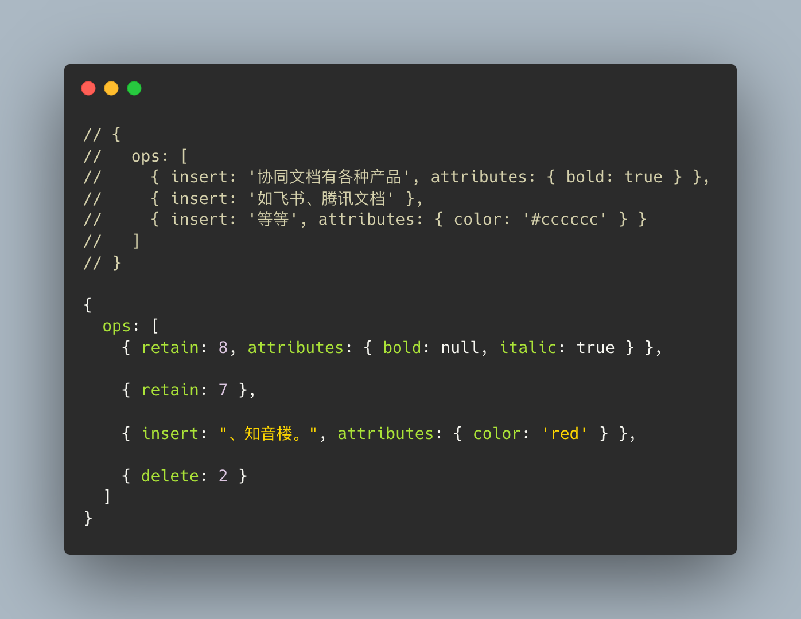
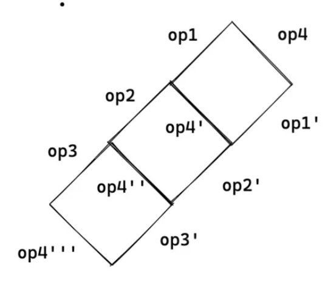

随着互联网技术的大爆发，如飞书、语雀、为知文档、Notion等等的协同文档产品雨后春笋般涌现。协同文档已经成为我们工作生活中不可缺少的生产力工具。但从另外一个层面来讲，协同文档与我们日常开发联系的少之又少，因此对于大多数同学来说，协同文档一直有一层神秘的面纱。借着本次分享，我们将换一个角度，不再仅仅是作为使用者，而尝试从一名开发者的角度，探究协同文档的「协同」及「编辑」能力的实现。话不多说，让我们开始本次的技术之旅吧。
协同文档核心功能是**可编辑**和**协同处理**，因此本次分享我将以这两个能力为基本架构，分别进行讨论。

### 目标

1. 了解富文本编辑器编辑能力的实现方式
2. 了解协同文档在处理协同场景下的策略和算法
3. 了解一个协同文档项目的基础实现和架构

# 1.「编辑」能力

## 1. 1 协同文档的前世今生

协同文档自问世至今，技术实现上有过几次重大革命，和人类的工业革命类似，我大致将其分为三个阶段：

**L0级别：茹毛饮血的原始人**


**L1级别：大航海时代的航海家** 


**L2级别：我们的目标是星辰大海**


接下来，我们将从这三个阶段，一步步探究协同文档的前世今生。

### 1.1.1 L0级别编辑器：Confluence

在L0阶段，我并没有将其称为协同文档，实际上我们的前辈们只实现了编辑器的基本**编辑**能力，协同的策略由于技术上的限制并没有被实现。此时我们只关心如何在浏览器中实现**可编辑能力。**

**可编辑能力：**

说起浏览器的编辑能力，其实大家都有接触，就是最简单的`Input`和`TextArea`组件，它基本可以满足我们日常生活中类似于表单类型的编辑需求，但如果我们想进一步实现复杂的富文本操作，他们就有些力不从心了。

好在浏览器提供了逃逸仓：`document.designMode`及`contenteditable`。

`designMode`的编辑效果作用于Document上，开启后会使整个页面变为可编辑状态，想要实现一个编辑器级别的编辑能力，往往需要嵌套一个Iframe来实现编辑区域的可控。

`contenteditable` 于designMode相比则更加灵活可控、代码简单。它是Html元素的通用属性。只需设置目标编辑区域元素`contenteditable`属性，则可以获取输入、编辑、光标等系统能力。

contentEditable 与designMode相比，转化成本可以忽略不计。因此在L0阶段编辑器中，我们主要基于`contenteditable`实现的可编辑能力。

[contenteditable - HTML（超文本标记语言） | MDN](https://developer.mozilla.org/zh-CN/docs/Web/HTML/Global_attributes/contenteditable)

**支持富文本能力：**

可编辑能力现在我们可以通过contentEditable来实现了，但仅仅可编辑能力还是无法满足编辑器的需求的，因此我们需要一个能力可以在可编辑区域对我们的富文本行为进行相应和处理。一个新的API出现了：

```jsx
document.execCommand(aCommandName, aShowDefaultUI, aValueArgument);
```

[document.execCommand - Web API 接口参考 | MDN](https://developer.mozilla.org/zh-CN/docs/Web/API/Document/execCommand)

在MDN中，execCommand通过接收命令参数，如早期非编辑器场景也会用到的copy、insertImage(插入图片)、insertOrderedList(插入有序图片)等等，至此，我们实现了一个富文本编辑器的所有能力。尽管这种操作并不优雅，还存在很大的问题，这个我们留到下个章节细说。

### 1.1.2 L1级别协同文档 ProseMirror

在L0阶段的编辑器，采用的解决方案是：`contenteditable` &`execCommand` 但很快，前端工程师们就陷入了无穷无尽的兼容性问题：

contenteditable在编辑场景下，例如删除内容，回车等操作下，副作用导致的DOM内容变化在不同平台是不一致的，我们无法准确稳定的预期浏览器对于编辑器操作的响应。execCommand同样存在该问题，例如：执行加粗操作时，不同浏览器的加粗行为也是不一致的。

并且，execCommand这一API局限性也过大，还是无法满足我们更为复杂的富文本编辑行为。


---

> 有关contentEditable兼容性问题，推荐一篇文章，可以称之为对contenteditable的檄文，作者从多个角度论证出contenteditable的不稳定性，最重要的一点就是**视觉内容（用户所见）与实际内容（DOM）的一对多关系，即`Render(x) = Render(y)`**渲染结果相同，但内部组成不同。
例如：相同的粗体操作，不同平台上有多种结构：
> 
> 
> ```html
> <strong><em>Majiaao</em></strong>
> <em><strong>Majiaao</strong></em>
> <em><strong>Ma</strong><strong>jiaao</strong></em>
> <em><strong>Majia</strong></em><strong><em>ao</em></strong>
> ```
> 

[Why ContentEditable is Terrible](https://medium.engineering/why-contenteditable-is-terrible-122d8a40e480)

---

这时候，L1级别协同文档出现了，其核心的实现思路如下：

1. L1级别协同文档与L0相似，依旧使用`contenteditable` 来复用浏览器原生的光标、选区能力。
2. 但由于上面提到的`contenteditable` 兼容性导致副作用不稳定的原因，我们不再信任`contenteditable` 产生的DOM变更结果。而是自主对DOM进行操作。如拦截浏览器鼠标，键盘事件，将用户的行为转化为**数据模型Model。【**数据模型我们后续会介绍到】
3. 在对用户的行为抽象化后，便可以将Model模型通过渲染器转化为稳定的DOM表现。

**主流协同文档的数据模型**

1. **Quill：Delta**
2. **Slate**:  **Value**
3. **EtherPad**: **changeSet**

---

### Delta模型

Quill 使用 Delta 作为其文本编辑器的底层数据模型，Delta模型可以同时描述变更和文档。当用户在 Quill 中进行文本编辑时，编辑器将用户的操作转换为 Delta 对象，然后可以将这个 Delta 对象存储在数据库中、传输到服务器或者从服务器获取 Delta 对象并在编辑器中还原用户的操作。Delta语义化强，对开发者较为优化。它的诞生就是为了处理协同文档场景下的操作描述。

Delta将用户的操作抽象为三种类型：

- Insert 插入
- Delete 删除
- retain 保持

让我们看下面这个例子：



---
****
### **Value模型**

Slate的Value模型与Delta扁平的数据模型不同，Value模型尽最大可能的保留了文档原有的树形结构。


### 1.1.3 L2级别协同文档

L2级别协同文档是目前最为先进的实现方式，L2级别的标志性特征在于放弃对浏览器contentEditable的依赖，转而自己去实现一套光标、选区。以此为代表的是Google Doc。在数据和行为完全自敛的背景下，L2级别的协同文档可以做更多的尝试，例如搭配多种内核的渲染器进行渲染优化，例如腾讯文档、GoogleDoc使用canvas进行内容渲染。

有关L2级别文档的底层实现，我们先掠过，本次分享的最后一个章节我们会详细介绍到。

# 「协同」能力

在我看来，协同的本质可以理解为：数据的实时同步+冲突的合并处理。

其中IO提供编辑能力的实时性，即用户可以实时的接收到来自其他用户的变更操作。而冲突的处理则保证用户编辑结果的一致性，即在协同场景下所有成员最终的结果是严格一致的。

### 实时同步

我们希望协同文档的通讯通道可以满足以下三点：

1. 实时
2. 稳定
3. 全双工

我们自然而然想到Websocket这一优先解。

当然，上面只是核心指标。往往在现实中还存在着这样那样的异常场景，因此我们还需要考虑心跳检测、断线重连等等。

### 冲突处理的方式

1. 编辑锁
2. 半自动Diff
3. 一致性算法
    1. OT算法
    2. CRDT算法
    3. G-Set算法
    4. 2P-Set算法

在这里我们重点介绍OT算法。

## OT算法

OT算法是编辑器协同问题的解决方案之一，目前市面上绝大多数协同文档都采用该方案。

从OT算法的名称「Operational Transformation」我们便大致可以猜出，OT算法的核心是**Transformation - 转换**。

该算法的底层原理是：对用户协同编辑中产生的并发操作进行转换。经过转换后，可能产生的冲突操作会被修正，然后把修正后的操作重新应用到文档中，最终保证操作的正确性和结果的一致性。

OT算法技术底层可以总结为四点：

1. 定义原子操作
2. 操作转换
3. 版本确认机制
4. 终端的状态转移

### 原子操作

在协同文档中，尽管用户可能存在着无数种编辑行为，但我们都可以将其抽象为三类操作，没错，这雨Delta模型如出一辙。

- Retain 保持操作 用大于0的数字表示 记录要保持的字符数量
- Insert 插入操作  用插入的字符串表示
- Delete 删除操作 用小于0的数字表示 -n就是删除n个字符

### 版本确认机制

### 操作转换

刚刚我们提到了，转换是OT算法的核心能力。操作转换的目标是保证基于转换后的操作，重新应用到文档后结果是一致的。

<aside>
💡 用数学的语言来形容OT算法核心的Transform操作：
opA，opB同时基于文档S1版本发出变更 → 我们希望transform算法实现：
transform(opA, opB) 的结果 [opA’，opB‘]使得 A端：apply(apply(S1, opA), opB’) === B端 apply(apply(S1, opB), opA’)
最终我们可以推导出公式：
S * opA * opB‘ === S * opB * opA’

</aside>

这一过程可以理解为一个菱形的转化机，起点版本相同，终点应用到各自的内容也相同。

S ‘hello word’

A insert(3, ‘希望学’) A应用在本地 hel希望学lo word B hel前端希望学lo word  B’

B insert(3, ‘前端’) B 应用在本地 hel前端lo word hel希望学前端lo word A’



> OT算法只是一个方法论，可以有很多种实现方式，例如**ShareDB**、**ot.js**、**ot-json**等等。
> 

有兴趣的同学可以阅读下ot.js对OT算法的具体实现：

[](https://github.com/Operational-Transformation/ot.js/blob/master/lib/text-operation.js)

### CRDT算法

CRDT算法是

# 我们编辑器的基本架构和实现

我们用了将近一年的时间将协同文档完全重构至L2级别，重构后编辑器的大致架构基本如下:



从上面的模块图可以大致了解到我们的编辑器的分层架构。在Core包中维护着一个最基本编辑器的全部功能，而其他的扩展项，如列表、表格、数学公式、代码块等则通过插件的方式注入到编辑器中，这点与Slate的设计思想有着相似之处：插件是一等公民，编辑器的任何能力都能通过插件的方式进行扩展或者自定义重写。

### Core

- 我们把关注点放回到Core中，探究在Core中，究竟是怎样在不借助contenteditable能力的同时实现的L2级别编辑能力。下面是我们编辑器的Interface
    
    ```typescript
    interface OnesEditor extends TypedEmitter<OnesEditorEvents> {
      readonly parent: HTMLElement;
      readonly rootElement: HTMLDivElement;
      readonly contentElement: HTMLDivElement;
      readonly rootContainer: ContainerElement;
      readonly scrollContainer: HTMLElement;
      readonly doc: OnesEditorDocWithExternalDoc;
      readonly input: OnesEditorInput;
      readonly selection: OnesEditorSelection;
      readonly selectionHandler: OnesEditorSelectionHandler;
      readonly id: string;
      readonly clientId: string;
      readonly compositingText: string;
      readonly undoManager: OnesEditorUndoManager;
      readonly shortcuts: OnesEditorShortcuts;
      readonly dataConverter: OnesEditorDataConverters;
      readonly editorBlocks: OnesEditorBlocks;
      readonly editorEmbeds: OnesEditorEmbeds;
      readonly editorBoxes: OnesEditorBoxes;
      readonly editorInsertions: OnesEditorInsertions;
      readonly editorDecorators: OnesEditorDecorators;
      readonly editorCommandProviders: OnesEditorCommandProviders;
      readonly editorBlockRenders: OnesEditorBlockRenderers;
      readonly blockHooks: OnesEditorBlockHook[];
      readonly options: OnesEditorOptions;
      readonly domEvents: OnesEditorDomEvents;
      readonly settingsProvider: OnesEditorSettingsProvider;
      version: string;
      readonly: boolean;
      addCustom: <T extends OnesEditorCustom>(name: string, creator: OnesEditorCustomCreator) => T;
      getCustom: <T extends OnesEditorCustom>(name: string) => T;
      replaceCustom: <T extends OnesEditorCustom>(name: string, newCustom: T) => T;
      findCustom: <T extends OnesEditorCustom>(name: string) => T | null;
      findCustomByType: <T extends OnesEditorCustom>(className: new (editor: OnesEditor) => T) => T | null;
      destroyCustom: (name: string) => void;
      getComponentOptions: <T>(name: string) => T | null;
      registerLocalEvents: (events: EditorDocLocalActionCallbacks) => void;
      // create dom
      createBlock: (path: BlockPath, container: ContainerElement, block: DocBlock) => BlockElement;
      createBox: (blockContent: BlockContentElement, box: DocBox) => BoxElement;
      createInsertion: (blockContent: BlockContentElement, insertion: DocInsertion) => InsertionElement;
      destroy: () => void;
      focus: () => void;
      focusToBlock: (block: BlockElement, options?: { tryFocusToChildSimpleBlock?: boolean }) => void;
      isWritable: () => boolean;
      isBlockWritable: (block: BlockElement | BlockElement[]) => boolean;
      reload: () => void;
      // container & blocks
      getChildContainerData: (childContainerId: string) => DocBlocks;
      createChildContainer: (path: BlockPath, parentElement: HTMLElement, childContainerId: string) => ContainerElement;
      getFirstBlock: () => BlockElement;
      getLastBlock: () => BlockElement;
      getFocusedBlock: () => BlockElement;
      findBlockById: (id: string) => BlockElement | null;
      findBoxById: (id: string) => BoxElement | null;
      getBlockById: (id: string) => BlockElement;
      getBoxById: (id: string) => BoxElement;
      getBlockByIndex: (containerId: string, blockIndex: number) => BlockElement;
      findBlockByIndex: (containerId: string, blockIndex: number) => BlockElement | null;
      getBlockIndex: (block: BlockElement | string) => number;
      getContainerById: (id: string) => ContainerElement;
      getParentContainer: (block: BlockElement) => ContainerElement;
      reloadBlock: (block: BlockElement) => void;
      // dom
      contains: (node: Node) => boolean;
      // actions
      getSelectedText: () => string;
      clearSelectedContents: () => void;
      insertBlock: (containerId: string, blockIndex: number, blockData: DocBlock, newRange?: OnesEditorDocRange, options?: InsertBlockOptions) => BlockElement;
      insertEmbed: (containerId: string, blockIndex: number, embedType: string, embedData: DocEmbedData, newRange?: OnesEditorDocRange, attributes?: DocBlockAttributes) => BlockElement;
      deleteBlock: (block: BlockElement, newRange?: OnesEditorDocRange) => void;
      // text
      getTextPosition: () => BlockTextPosition;
      getBlockString: (block: BlockElement, options?: { boxReplacement: string }) => string;
      getBlockData: (block: BlockElement) => DocBlock;
      getBlockText: (block: BlockElement) => DocBlockText;
      setBlockText: (block: BlockElement, text: DocBlockText) => void;
      getBoxData: (box: BoxElement) => DocBox;
      deleteTextFromBlock: (block: BlockElement, offset: number, count: number, options?: InsertTextOptions) => number;
      insertTextToBlock: (block: BlockElement, offset: number, text: string | DocBlockText, options?: InsertTextOptions) => DocBlockText;
      insertBoxToBlock: (block: BlockElement, offset: number, boxData: DocBox) => DocBlockText;
      mergeTextBlock: (block1: BlockElement, block2: BlockElement, options?: { focus?: boolean }) => DocBlockText;
      breakTextBlock: (block: BlockElement, offset: number, options?: BreakTextOptions) => BlockElement;
      insertTextBlock: (text?: string | DocBlockText, containerId?: string, blockIndex?: number, options?: { newRange?: OnesEditorDocRange; insertBlockOptions?: InsertBlockOptions }, attributes?: DocBlockAttributes) => BlockElement;
      insertDoc: (block: BlockElement, offset: number, doc: DocObject, cloneDocResult?: CloneBlockResultInfo) => void;
      insertDocAt: (container: ContainerElement, blockIndex: number, doc: DocObject, cloneDocResult?: CloneBlockResultInfo) => BlockElement[];
      pasteDoc: (doc: DocObject) => Promise<void>;
      deleteChildContainers: (containerIds: string[]) => void;
      // data
      updateBlockData: (block: BlockElement, data: DocBlockAttributes, newRange?: SelectionRange) => DocBlock;
      updateEmbedData: (block: BlockElement, data: DocEmbedData, newRange?: SelectionRange) => DocBlock;
      updateBoxData: (boxData: DocBox, options?: InsertTextOptions) => void;
      updateCompositionText: (text: string, end: boolean) => void;
      getColor: (index: number, type?: string) => string;
    }
    ```
    
    
    

看到这么多的属性和方法，此时可能大家已经没有继续看下去的欲望了，但其中Input属性你可能会很熟悉，直觉告诉我们，它一定和编辑器的输入有关系。

没错，事实上就是这样，Input是编辑器中的事件中枢。在用户实例化编辑器的一刻开始，我们创建了一个Input元素，强行将页面的焦点聚焦在这个元素上。我们只需要监听用户在Input上的一切行为，便可以推测出用户希望实现的编辑器操作。


### 编辑器从用户从输入一个字母到完成响应都做了些什么？



### **编辑器的插件系统是如何组织的**

在我们的编辑器中，将功能总结为四大类型

- Block
    
    ```tsx
    interface Block {
      blockType: string;
      blockKind: BlockKind;
      createBlockContent: (editor: OnesEditor, path: BlockPath, container: ContainerElement, blockElement: BlockElement, blockData: DocBlock) => BlockContentElement;
      getBlockTextLength: (block: BlockElement) => number;
      getRangeFromPoint: (editor: OnesEditor, block: BlockElement, x: number, y: number) => SelectionRange | null;
      moveCaret: (editor: OnesEditor, block: BlockElement, position: SimpleBlockPosition, direction: MoveDirection) => SimpleBlockPosition | null;
      getCaretRect: (block: BlockElement, pos: SimpleBlockPosition) => DOMRect;
      updateSelection: (editor: OnesEditor, block: BlockElement, from: BlockPosition, to: BlockPosition) => void;
      clearSelection: (editor: OnesEditor) => void;
      //
      getBlockProperties?: (editor: OnesEditor, block: BlockElement) => BlockProperties;
      getOptions?: (editor: OnesEditor) => BlockOptions;
      notify?: (editor: OnesEditor, command: string, params?: unknown) => unknown | undefined;
      // event
      handleBlockElementUpdated?: (editor: OnesEditor, block: BlockElement, blockData: DocBlock) => void;
      handleContainerResized?: (editor: OnesEditor, block: BlockElement) => void;
      handleDeleteBlock?: (editor: OnesEditor, block: BlockElement, local: boolean, options: DeleteBlockEventOptions) => void;
      handleUpdateBlock?: (editor: OnesEditor, block: BlockElement, blockData: DocBlock) => boolean;
      handleDropOver?: (editor: OnesEditor, block: BlockElement, dragData: DragObject | DataTransferItemList | null, x: number, y: number) => DropInsertPos | false | undefined;
      handleDrop?: (editor: OnesEditor, block: BlockElement, dragData: DragObject | File[], insertPos: DropInsertPos, options: DropOptions) => boolean | undefined;
      //
      getClientRects?: (editor: OnesEditor, block: BlockElement, range: SelectionRange) => DOMRect[];
      getMinWidth?: (editor: OnesEditor, block: BlockElement) => number | undefined;
      convertFrom?: (editor: OnesEditor, srcBlock: BlockElement, options: { offset: number; data?: DocBlockAttributes }) => ConvertBlockResult | null;
      selectionToDoc?: (editor: OnesEditor, selectedBlock: SelectedBlock) => DocObject;
      convertTo?: (editor: OnesEditor, blockData: DocBlock, doc: DocObject, type: 'text' | 'html' | 'markdown', path: BlockPath) => string;
      toStandardDoc?: (editor: OnesEditor, blockData: DocBlock, doc: DocObject) => Promise<DocObject | undefined>;
      getBlockStyles?: (editor: OnesEditor, block: BlockElement) => BlockStyles;
      // for clone doc
      blockToDoc?: (srcDoc: DocObject, srcBlockData: DocBlock, childBlockConverter: (srcDoc: DocObject, srcBlockData: DocBlock) => DocObject) => DocObject;
      // get and replace resources
      getResources?: (editor: OnesEditor, data: DocBlock) => string[] | null;
      replaceResources?: (data: DocBlock, resources: Map<string, string>) => void;
    }
    ```
    
- Embed
    
    ```tsx
    export interface Embed {
      embedType: string;
      createEmbedContent: (editor: OnesEditor, content: BlockContentElement, block: DocEmbedBlock, path: BlockPath, container: ContainerElement, blockElement: BlockElement) => void;
      convertTo?: (editor: OnesEditor, blockData: DocEmbedBlock, doc: DocObject, type: 'text' | 'html' | 'markdown') => string;
      getBlockProperties?: (editor: OnesEditor, block: BlockElement) => BlockProperties;
      getOptions?: (editor: OnesEditor) => EmbedOptions;
      handleDeleteBlock?: (editor: OnesEditor, block: BlockElement, local: boolean, options: DeleteBlockEventOptions) => void;
      handleUpdateBlock?: (editor: OnesEditor, block: BlockElement, blockData: DocEmbedBlock) => boolean;
      handleDropOver?: (editor: OnesEditor, block: BlockElement, dragData: DragObject | DataTransferItemList | null, x: number, y: number) => DropInsertPos | undefined;
      handleDrop?: (editor: OnesEditor, block: BlockElement, dragData: DragObject | File[], insertPos: DropInsertPos, options: DropOptions) => boolean | undefined;
      convertFrom?: (editor: OnesEditor, srcBlock: BlockElement, options: { offset: number; data?: DocBlockAttributes }) => ConvertBlockResult | null;
      toStandardDoc?: (editor: OnesEditor, blockData: DocBlock, doc: DocObject, path: BlockPath) => Promise<DocObject | undefined>;
      getResources?: (editor: OnesEditor, blockData: DocBlock) => string[];
    }
    ```
    
- Box
    
    ```tsx
    export interface Box {
      boxType: string;
      updateBoxContent: (editor: OnesEditor, boxElement: BoxElement, boxContent: BoxContentElement, boxData: DocBox) => void;
      convertFrom?: (editor: OnesEditor, text: string) => DocBox | null;
      convertTo?: (editor: OnesEditor, boxData: DocBox, doc: DocObject, type: 'text' | 'html' | 'markdown') => string;
      handleClickBox?: (editor: OnesEditor, box: BoxElement, event: MouseEvent) => void;
      toStandardText?: (editor: OnesEditor, box: DocBox) => Promise<DocBlockText | undefined>;
      getBoxProperties?: (editor: OnesEditor, boxElement: BoxElement) => BoxProperties;
      getResources?: (editor: OnesEditor, box: DocBox) => string[] | null;
      matchText?: (editor: OnesEditor, box: DocBox, keyword: string) => boolean;
    }
    ```
    
- Insertion
    
    ```tsx
    export interface Insertion {
      insertionType: string;
      updateInsertionContent: (editor: OnesEditor, insertionElement: InsertionElement, boxContent: InsertionContentElement, childData: DocInsertion) => void;
    }
    ```
    

在Editor中枢无论是根据Doc初始化渲染、op触发变更的情况下，复制粘贴都会触发这些插件的注册方法，而编辑器内核的分发体系如Update时，只需关注针对变更内容进行patch优化操作即可。

> 今天我的技术分享到这里就结束了，协同文档作为前端领域的几大天坑之一，它的知识体系非常庞大，本次分享我们只介绍了部分知识，希望可以抛砖引玉，有兴趣的同学可以进一步的了解和学习。最后祝大家周末愉快！
> 

