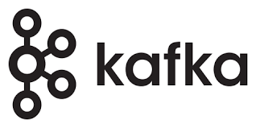

想象一下，现在有一个庞大的应用程序，其中许多复杂的功能紧密地联系在一起。此时项目的可扩展性将是一个很大的挑战，部署过程可能会变得非常繁琐，并且由于内部组件高度耦合，改变功能流程也并非轻而易举。

上面的这个架构大家应该都熟悉，因为直到几年前这依旧是构建应用程序的标准方法，但随着云服务技术井喷式发展后，构建产品的过程转向了微服务。微服务代表着具有明确范围的小型服务，可以与其他服务进行通信以完成业务范围，每一个服务仅关注其负责的业务流程。然而，并不是所有事情都是甜蜜的。这种情况很快演变为有很多微服务，每一个服务与其他服务通信。这好像又回到了单体服务时意大利面纠缠那样“绑定”在一起的组织逻辑。

为了克服这种问题，一些微服务应用采用了事件驱动架构，事件驱动可能会有各类实现方式，例如事件通知、事件源、事件承载状态转移等。而kafka也就是在这个时候诞生。

<!--more-->

# Kafka

## 目录

- [背景](notion://www.notion.so/majiaao/Kafka-1f38d92d92ff4584a3426fb94e787307#%E8%83%8C%E6%99%AF)
- [1. 什么是Kafka](notion://www.notion.so/majiaao/Kafka-1f38d92d92ff4584a3426fb94e787307#1-%E4%BB%80%E4%B9%88%E6%98%AFkafka)
    - [1.1 Kafka的应用场景](notion://www.notion.so/majiaao/Kafka-1f38d92d92ff4584a3426fb94e787307#11-kafka%E7%9A%84%E5%BA%94%E7%94%A8%E5%9C%BA%E6%99%AF)
- [2. Kafka的核心知识](notion://www.notion.so/majiaao/Kafka-1f38d92d92ff4584a3426fb94e787307#2-kafka%E7%9A%84%E6%A0%B8%E5%BF%83%E7%9F%A5%E8%AF%86)
    - [2.1 基础的Kafka架构](notion://www.notion.so/majiaao/Kafka-1f38d92d92ff4584a3426fb94e787307#21-%E5%9F%BA%E7%A1%80%E7%9A%84kafka%E6%9E%B6%E6%9E%84)
    - [2.2 Kafka Cluster](notion://www.notion.so/majiaao/Kafka-1f38d92d92ff4584a3426fb94e787307#22-kafka-cluster)
    - [2.3 Consumer Cluster](notion://www.notion.so/majiaao/Kafka-1f38d92d92ff4584a3426fb94e787307#23-consumer-cluster)
    - [2.4 基础知识总结](notion://www.notion.so/majiaao/Kafka-1f38d92d92ff4584a3426fb94e787307#24-%E5%9F%BA%E7%A1%80%E7%9F%A5%E8%AF%86%E6%80%BB%E7%BB%93)
- [3. Kafka的底层原理](notion://www.notion.so/majiaao/Kafka-1f38d92d92ff4584a3426fb94e787307#3-kafka%E7%9A%84%E5%BA%95%E5%B1%82%E5%8E%9F%E7%90%86)
    - [3.1 Kafka的底层执行流程](notion://www.notion.so/majiaao/Kafka-1f38d92d92ff4584a3426fb94e787307#31-kafka%E7%9A%84%E5%BA%95%E5%B1%82%E6%89%A7%E8%A1%8C%E6%B5%81%E7%A8%8B)
        - [3.1.1 建立连接流程](notion://www.notion.so/majiaao/Kafka-1f38d92d92ff4584a3426fb94e787307#311-%E5%BB%BA%E7%AB%8B%E8%BF%9E%E6%8E%A5%E6%B5%81%E7%A8%8B)
        - [3.1.2 消费流程](notion://www.notion.so/majiaao/Kafka-1f38d92d92ff4584a3426fb94e787307#312-%E6%B6%88%E8%B4%B9%E6%B5%81%E7%A8%8B)
    - [3.2 Kafka数据的存储位置](notion://www.notion.so/majiaao/Kafka-1f38d92d92ff4584a3426fb94e787307#32-kafka%E6%95%B0%E6%8D%AE%E7%9A%84%E5%AD%98%E5%82%A8%E4%BD%8D%E7%BD%AE)
    - [3.3 Kafka如何实现高吞吐读写](notion://www.notion.so/majiaao/Kafka-1f38d92d92ff4584a3426fb94e787307#33-kafka%E5%A6%82%E4%BD%95%E5%AE%9E%E7%8E%B0%E9%AB%98%E5%90%9E%E5%90%90%E8%AF%BB%E5%86%99)
- [4. 学习收获](notion://www.notion.so/majiaao/Kafka-1f38d92d92ff4584a3426fb94e787307#4-%E5%AD%A6%E4%B9%A0%E6%94%B6%E8%8E%B7)
    - [4.1 举一反三](notion://www.notion.so/majiaao/Kafka-1f38d92d92ff4584a3426fb94e787307#41-%E4%B8%BE%E4%B8%80%E5%8F%8D%E4%B8%89)
    - [4.2 踩过的坑-重复消费问题](notion://www.notion.so/majiaao/Kafka-1f38d92d92ff4584a3426fb94e787307#42-%E8%B8%A9%E8%BF%87%E7%9A%84%E5%9D%91-%E9%87%8D%E5%A4%8D%E6%B6%88%E8%B4%B9%E9%97%AE%E9%A2%98)

# 1. 什么是Kafka

在Kafka的官网中，是这样描述Kafka的：

> Apache Kafka is an open-source distributed event streaming platform used by thousands of companies for high-performance data pipelines, streaming analytics, data integration, and mission-critical applications.
> 

结合Kafka的自述，我们大致可以对Kafka给出以下理解：Kafka是一个具有**高吞吐**的**高性能、分布式日志系统**，同样也是一个微服务生态架构中可插拔的连接器。

## 1.1 Kafka的应用场景

- 流量削峰
    
    短时间内上游可能出现突发流量，下游一些非主流程的服务资源并不充分，很难扛住如此大的流量。这时候便可以使用kafka上下游之间起到一个缓冲的作用。上游服务将待处理消息暂存在Kafka中，下游服务就可以按照自己的节奏进行慢慢处理。
    
- 去除冗余逻辑
    
    可以采用一对多的方式，一个生产者发布消息，可以被多个订阅Topic的服务消费到，供多个毫无关联的业务使用。
    
- 健壮性
    
    与削峰类似，Kafka消息队列可以堆积请求，所以即使消费端服务暂时宕机，也不会影响主要业务的正常进行。
    
- 异步通信
    
    以用户操作成功后的短信通知为例，很多场景下用户对事件处理的及时度实际上并不敏感，因此可以使用Kafka消息队列的异步处理机制。它允许用户把一个消息放入队列，但并不立即处理它。想向队列中放入多少消息就放多少，然后在需要的时候再去处理它们。
    

# 2. Kafka的核心知识

## 2.1 基础的Kafka架构

Kafka的入门并不困难，一个生产者：Producer，一个消费者：Consumer。便组成了一个最简单的Kafka架构。而连接两者的Topic，正如他的名称一样：所有生产者产出的消息，都会存储在对应的Topic中。

## 2.2 Kafka Cluster

上面的架构虽然可以实现一个最基础的Kafka功能，但在实际开发中是远远不够的。例如618、双十一、12306这类高并发的场景下，系统底层会有上百个服务集群在充当生产者的角色，短时间内会创建出大量的待消费数据。例如线上瞬间出现了100T的待消费数据，此时单台服务器肯定是无法存储如此大规模的数据的。因此Kafka遵循着类似于Hadoop（一个大规模数据集集群化分割计算的解决方案）：**分而治之**的策略，Kafka可以自由扩展，通过集群的方式，分割数据，这也就引出了Kafka一个新的概念：**Broker**和**Partition**。其架构如下：

## 2.3 Consumer Cluster

在上面我们为了解决生产者数据存储、分发效率问题，我们引入了Broker集群。但此时，消费效率并没有提升，一次还是一个Consumer，显然是无法及时消费如此规模的数据。因此我们开始考虑扩展消费者为集群，此时，我们引入了新的概念：**Consumer Group。**

上面的截图是我在本地启动了一个Kafka服务，并通过Kafkajs进行链接。上面这条日志标识着本地Kafka消费者加入了Kafka消费者组中，列举的几个参数可以重点关注：

| group_id  | 消费者组的唯一标识 |
| --- | --- |
| isLeader | 暂且不讲，后面再介绍工作流程是会有涉及 |
| memberAssignment | 标识着该消费者消费的目标Topic和对应的Paration分区 |
| groupProtocol | 消费者分配协议算法，RoundRobin、Range、Sticky，他们实际上是Kafka Portition分配消费的策略算法，在平时的开发中可以忽略，但如果设计不同机器集群的消费调优，该配置很重要。 |

## 2.4 基础知识总结

我们回顾一下刚刚接触到的Kafka的核心知识点：

| **Producer** | **Producer主要是用于生产消息，是Kafka当中的消息生产者。生产的消息通过Topic进行归类，保存到Kafka的broker中。** |
| --- | --- |
| **Consumer** | **Consumer是Kafka当中的消费者，主要用于消费Kafka当中存储的数据，而1消费者一定是归属于某个消费组中的。** |
| **Topic** | **1. Topic是一个逻辑层面上的定义。
2. Kafka将消息以Topic为单位进行归类。
3. Topic是一种分类或者发布的一些列记录的名义上的名字。Kafka主题始终是支持多用户订阅的；也就是说，一 个主题可以有零个，一个或者多个消费者订阅写入的数据。
4. 在Kafka集群中，可以有无数的主题。
5. 生产者和消费者消费数据一般以主题为单位。更细粒度可以到分区级别。** |
| **Broker** | **Kafka集群中包含一个或者多个服务实例（节点），这种服务实例被称为Broker，一个Broker就是一个节点或者一个服务器。** |
| **Partition** | **Partition是一个物理上的概念，每个Topic包含一个或者多个Partition。** |
| **Consumer Group** | **消费者组，每一个 Consumer 属于一个特定的 consumer group（可以为每个consumer指定 GroupName）** |

## 2.5 Kafka的主从策略

现在我们知道，Broker作为服务节点，内部存储着Kafka分布的消费数据。假设某一个时间点，某台服务器宕机了，如何保证Kafka内部的数据不受影响呢？其实很简单，Kafka可以通过配置Replicaiton_factor来增加数据的副本分片：

多副本机制提供了**自动故障转移**的能力，在复制因子为3的场景中，即便同时出现2个 Broker 宕机，剩余的一个Broker，也有完整的三个Partition分区的数据。

当一切正常时：

- **leader 负责处理 partition 的所有读写请求**
- **follower 则负责被动地去复制 leader 上的数据**

# 3 Kafka的底层原理

## 3.1 Kafka的底层执行流程

### 3.1.1 建立连接流程

### **3.1.2 消费流程**

## 3.2 Kafka数据的存储位置

一直以来在大家的认知中，机械硬盘与固态硬盘相比，读写速度可能差距极大，然而固态硬盘价格是同大小的机械硬盘的数倍。因此从数据规模、数据存储时间以及性价比多方面考虑，Kafka选择将消息记录持久化到本地机械磁盘中。那么Kafka是如何在机械硬盘上进行I/O优化的呢？

## 3.3 KafKa如何实现高吞吐读写

[Apache Kafka](https://kafka.apache.org/documentation/#persistence)

### 3.3.1 机械硬盘的工作原理

[https://www.youtube.com/watch?v=NtPc0jI21i0](https://www.youtube.com/watch?v=NtPc0jI21i0)

[https://www.youtube.com/watch?v=mHrSsorRUyI](https://www.youtube.com/watch?v=mHrSsorRUyI)

由此可知：

机械硬盘是一种存储设备，其结构包括盘片、读写头、主轴电机、磁头臂和控制电路等组成部分。数据被存储在盘片上的磁性表面上，读写头通过移动到适当位置扫描盘片上的数据并将其传输到计算机处理器中。

机械硬盘的工作原理是：当计算机需要访问硬盘上的数据时，控制电路将命令发送给主轴电机来旋转盘片，然后读写头移动到正确的位置以便读取或写入数据。

### 3.3.2 顺序读写

我们了解了Kafka的工作流程以及机械硬盘的工作原理。可以认识到，在Kafka中Topic是一个逻辑上的概念，而Partition是物理上的分层。然而，Partition并非是Kafka的原子组成。Partition还可以拆分为多个**segment。**每个segment包含着.log以及.index文件，其层级关系如下：

log 文件中存储的就是Producer生产的数据，Producer 生产的数据会被不断的添加到 log 文件的末端。而.index文件夹则记录着同级别log文件存储数据的索引值。

**写入优化：**

在Linux系统中，所有文件IO操作都是通过PageCache机制实现的。

PageCache是磁盘文件的一种读写管理方式，对于Linux操作系统，磁盘上文件都是由一系列的数据块组成，数据块的大小一般是4KB。

用户应用写入数据后，并不是直接写到磁盘的，而是先写到操作系统的Buffer中，再提交到PageCache中。最后由操作系统刷入磁盘，至于什么时候刷入磁盘，由操作系统决定。对于用户应用来说，数据提交到内核的PageCache缓冲区后，即可认为数据写入成功。

Kafka进行写操作时，是提前创建一个文件，后续内容追加到该文件对应磁盘空间中，达到顺序读写的目的。减少随机IO带来的损耗。

# 4 学习收获

## 4.1 知识体系的关联性

### Kafka与计算机网络中相似的设计

kafka生产者并不是调用一次API就发起一次网络请求，为了高性能其中底层Kafka做了很多操作。例如在Producer端，存在2个线程，Producer主线程用户在客户端调用send message时，将发送数据缓存到RecordAccumulator中，Send方法返回调用结果，此时并不能确定消息是否真正的发送到broker。另外一个是Sender IO线程，其不断轮询RecordAccumulator，满足一定条件后：即RecordAccumulator内batchSize满足预期大小、或者等待时间超时，就进行真正的网络IO发送。当Sender线程发送完后，回调函数将被调用，可以用来处理成功，失败或异常的逻辑。

这一点和TCP的滑动窗口粘包策略类似：

另外还有很多可以头脑风暴的点：

| Kafka知识体系 | 可以扩展的知识体系 |
| --- | --- |
| Kafka的ACK机制 | TCP的三次握手，四次挥手 |
| Kafka的心跳机制以及饥饿状态 | WebSocket、TCP的应答检测 |

### Kafka顺序读写的策略与JavaScript V8 GC机制相似的设计

下面是JavaScript V8引擎垃圾回收的过程，我们本次并不讨论新生代、老生代等等内存转换规则，主要关注垃圾回收的目的：从下面的图可以看出，垃圾回收机制采用了空间换时间的方式，在每一次垃圾回收结束后，**优化内存存储结构，使处在生命周期中的对象在内存中存储的地址尽可能的连续，从而最大程度利用内存。**

而在Kafka中，我认为顺序读写策略与其相似，虽然一个是优化内存利用率（V8引擎），一个是从硬件角度优化，将数据尽可能存储在最近的扇区。

### 简单的算法也可以给项目带来性能上的提升

在顺序读写中，我们认识到Partition是有很多log日志文件以及索引文件组成的，index文件中，记录着松散的message对应的偏移，这一点可以理解，如果index记录了所有偏移，随着数据的增多，index文件也会占用过多的空间。现在的做法是，每隔一定字节的数据建立一条索引，在需要确定某个offset提交时，根据这些松散的索引，确定大致的范围，再通过二分法进行搜索。

## 4.2 踩过的坑-重复消费问题

在灰度环境压测的过程中，发现有几条数据存在重复消费。但在本地压测过程中，却没有复现。通过查询日志发现，原因如下：

开发使用的是KafkaJS：

[KafkaJS · KafkaJS, a modern Apache Kafka client for Node.js](https://kafka.js.org/)

Kafkajs在消费者API中，对外暴露了两个处理方法：

1. eachMessage

1. eachBatch

通过介绍可以了解到，eachMessage是KafkaJS对eachBatch的一个上层封装，也更推荐使用eachMessage，因为commit offset这类操作都是自动化的，调用方只需要关注对任务的处理即可，事实上最开始我们也是这样做的。

但是，在我们的业务场景中，往往一个任务需要处理超过90s，这就导致eachMessage会触发消费者组的重平衡，这本来是符合预期的，但eachMessage并没有在重平衡时，提交成功的offset。这就导致，其实已经处理过的任务，又被重分配到了其他的消费者服务上，造成了重复消费。

**解决方法：**

使用eachBatch，通过控制批拉取的数量、手动控制offset的提交，从而避免了重复消费。