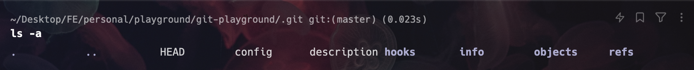
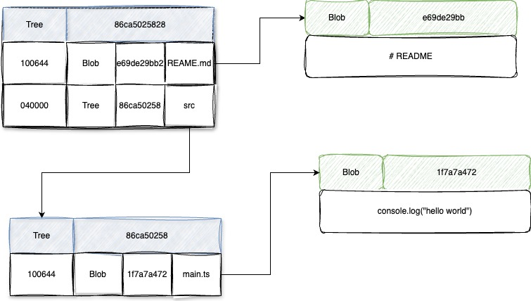
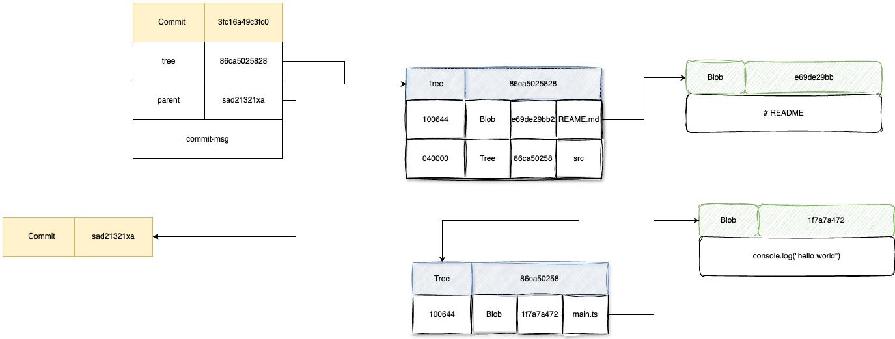

Git是一个最流行的**分布式版本控制系统**，我们在日常的开发过程中每天都会使用到，可能你对git：add、status、commit、push、pull、merge，这些命令已经再熟悉不过。因此这些基础的能力不在我们本次分享的范围内。我们来点不一样的，聊聊你可能不了解的，git的另一面。
<!--more-->

# 你真的了解git嘛

> 
- [前言](notion://www.notion.so/majiaao/git-dbb8f7daf7a84b8e8b1dd67bfebbc8c4#1.%E5%89%8D%E8%A8%80)
- [Git的底层命令和上层命令](notion://www.notion.so/majiaao/git-dbb8f7daf7a84b8e8b1dd67bfebbc8c4#2.-Git%E7%9A%84%E5%BA%95%E5%B1%82%E5%91%BD%E4%BB%A4%E5%92%8C%E4%B8%8A%E5%B1%82%E5%91%BD%E4%BB%A4)
- [当git init的时候，都发生了什么](notion://www.notion.so/majiaao/git-dbb8f7daf7a84b8e8b1dd67bfebbc8c4#3.-%E5%BD%93git-init%E7%9A%84%E6%97%B6%E5%80%99%EF%BC%8C%E9%83%BD%E5%8F%91%E7%94%9F%E4%BA%86%E4%BB%80%E4%B9%88)
- [git都做了些什么？](notion://www.notion.so/majiaao/git-dbb8f7daf7a84b8e8b1dd67bfebbc8c4#4.-git%E9%83%BD%E5%81%9A%E4%BA%86%E4%BA%9B%E4%BB%80%E4%B9%88%EF%BC%9F)
    - [Git对象](notion://www.notion.so/majiaao/git-dbb8f7daf7a84b8e8b1dd67bfebbc8c4#4.1-Git%E5%AF%B9%E8%B1%A1)
        - [数据对象类型](notion://www.notion.so/majiaao/git-dbb8f7daf7a84b8e8b1dd67bfebbc8c4#4.1.1-%E6%95%B0%E6%8D%AE%E5%AF%B9%E8%B1%A1%E7%B1%BB%E5%9E%8B)
        - [树对象类型](notion://www.notion.so/majiaao/git-dbb8f7daf7a84b8e8b1dd67bfebbc8c4#4.1.2-%E6%A0%91%E5%AF%B9%E8%B1%A1%E7%B1%BB%E5%9E%8B)
        - [Commit提交对象类型](notion://www.notion.so/majiaao/git-dbb8f7daf7a84b8e8b1dd67bfebbc8c4#4.1.3-Commit%E6%8F%90%E4%BA%A4%E5%AF%B9%E8%B1%A1%E7%B1%BB%E5%9E%8B)
- [来点好玩的](notion://www.notion.so/majiaao/git-dbb8f7daf7a84b8e8b1dd67bfebbc8c4#5.-%E6%9D%A5%E7%82%B9%E5%A5%BD%E7%8E%A9%E7%9A%84)
- [Git引用](notion://www.notion.so/majiaao/git-dbb8f7daf7a84b8e8b1dd67bfebbc8c4#6.-Git%E5%BC%95%E7%94%A8)
- [头脑风暴](notion://www.notion.so/majiaao/git-dbb8f7daf7a84b8e8b1dd67bfebbc8c4#7.-%E5%A4%B4%E8%84%91%E9%A3%8E%E6%9A%B4)

# 1.前言

在我们日常使用 [Git](http://mp.weixin.qq.com/s?__biz=MzIyODE5NjUwNQ==&mid=2653363312&idx=1&sn=d71476a477cb1eb1137568896c41959e&chksm=f3861586c4f19c90d2866f3b9463b0fd4ed4225f162dd904503e266b929932ee93b28bcb51a2&scene=21#wechat_redirect) 时，通常的操作是：

- 在写完一段代码后，执行 `git add`命令，将这段代码添加到暂存区中；
- 然后再执行 `git commit`和 `git push` 命令，将 本地 Git 版本库中的提交同步到服务器中的版本库中；

Git 在中间做了什么，它如何存储不同的文件和内容，以及如何区分不同分支下的文件版本呢？日常操作对这些自动的操作都是无感的。今天抛砖引玉，和大家一起研究下，Git 对象的原理；

# 2. Git的底层命令和上层命令

我们在日常开发过程中，经常会使用到如下命令：`add status commit push pull merge rebase`这些在Git的体系中，被规为**上层命令。**在Git一般的使用过程中，我们对上层命令熟悉即可，但如果想要探究Git的执行方式和工作原理，我们就要了解Git**底层命令。**

要知道，多数的底层命令并不面向普通用户，它们更适合作为新工具的组件和自定义脚本的组成部分。实际上，上面我们提到的这些上层命令，实际上就是通过这些底层命令实现的。

# 3. 当git init的时候，都发生了什么

当执行`git init` 命令时，git脚本会在当前目录下创建.git文件。git文件是一个隐藏文件，大多数情况下我们不会去关心这个文件中的一切信息。但从此时开始，项目未来所有的变更记录都会在这个文件中存储。接下来，让我们看看在.git目录下，都放置了些什么？



上面是一个git文件内容，包含着一些信息文件，和存储文件；

### HEAD

记录了当前所在分支或者提交的引用。

### config

git config 文件包含项目特有的配置选项

### hooks

包含了客户端和服务器端的钩子脚本。这些脚本在特定的 Git 事件（如提交、合并等）发生时执行。例如：pre-commit、commit-msg、post-commit

### info

包含了一些全局信息，比如排除文件`exclude`列表等。

### objects

存储了 Git 的核心对象，包括 blob 对象（文件内容）、tree 对象（目录结构）、commit 对象（提交信息）和标签对象（标签信息）。

### refs

存储了引用`references`，包括分支、标签和远程仓库的引用。

### index

当前时刻暂存区，稍后我们会讲到。

# 4. git都做了些什么？

在上面我们提到了，我们平时在使用中，经常使用到的都是上层命令，这些命令实际上是由很多底层命令组合实现的。其实git在我们不知道的地方，为我们默默做了很多事。接下来，我们就来看看，git都默默做了些什么。

## 4.1 Git对象

在Git中存在多种对象类型：最常用的是：**数据对象类型、树对象类型、提交对象类型**。这些表述可能听上去比较抽象。接下来，我将会和大家一起，一个个去了解他们的功能和用途。首先，让我们了解Git的数据对象类型；

首先，本质上讲，Git是一个版本管理系统。其最重要的功能便是对文件内容变更的记录。

### 4.1.1 数据对象类型

想象一个最简单的场景：我们创建一个代码片段内容，此时，Git应该要将这些内容存储至其内部的键值对数据库中（你可以理解为一个类似Redis的键值对数据库）

```bash
echo "hello word" | git hash-object -w --stdin
# output: 7fd5222177e8ffadda6437dc9cfa0630a2777673
```

git返回了一串SHA-1 哈希值，是不是很眼熟？没错，Git中我们经常会看到的GitLog commit-hash其实就是如此。GIt通过文件内容及文件头信息计算出该散列值。这类数据元存储的方式在Git中被称为数据对象。但不要着急，这个和我们的提交还有很大的不同，我们继续下去。

在上面，我们在对git目录下的功能研究中提到过，objects文件中，存储着Git的核心数据，那是否刚刚创建的数据就在objects文件中呢？

```bash
find .git/objects
```


bingo，果然在objects文件中，git以哈希值前两位作为命名空间，之后的字符串作为存储名称进行存储。

上一步中，我们以内容为基底，存储了一段文字。那我们该如何从git中还原这段文字呢？

```bash
git cat-file -p 7fd5222177e8ffadda6437dc9cfa0630a2777673
# output: hello word
```

在上面，我们成功的将一段数据存储在Git中，并最后还原了出来。但在实际开发过程中，往往最底层的作用单位是文件。其实逻辑是相通的：

```bash
echo 'version 1' > test.txt
git hash-object -w test.txt
# output: 83baae61804e65cc73a7201a7252750c76066a30
```

继续，我们创造开发中的变更场景：

```bash
echo 'version 2' > test.txt
git hash-object -w test.txt
# output: 1f7a7a472abf3dd9643fd615f6da379c4acb3e3a
```

此时我们再来看objects文件中，出现了有关test.txt的两个版本记录哈希。


此时有了git缓存记录，我们能否将变动更新到本地呢，让我们来试试。

删除当前目录下的text.txt文件，将git hash中的数据写入新的文件中：

```bash
git cat-file -p 83baae61804e65cc73a7201a7252750c76066a30 > note.txt
cat note.txt
# version 1
```

可以看到，note.txt中的内容就是我们第一次变更的版本。那第二次的变更呢？

```bash
git cat-file -p 1f7a7a472abf3dd9643fd615f6da379c4acb3e3a > note.txt
cat note.txt
# version 2
```

完美！但问题又来了。

虽然上面我们好像实现了一套Git的最基础功能，但却存在着很多问题：

1、 在使用过程中，我们必须要记住每个变更的哈希值，这显然不合理。

2、在上面的版本记录中，实际上是以行为为基础，在真实的使用场景中，我们要记录的是以文件为基础。在上面的方案中，我们并没有记录文件的名称。因此，我们引入了一个新的概念：**树对象；**

### 4.1.2 树对象类型

树对象，顾名思义，就是通过最形象的树型组织方式映射文件目录结果，从而描述git的数据对象。在树对象中，其子叶可以是一个数据对象类型，也可以是另一个树对象类型。

例如，在一个项目中，其目录结构如下：

```bash
│  README.md
└─ src
     main.ts
```

```bash
git cat-file -p test^{tree}
100644 blob 1f7a7a472abf3dd9643fd615f6da379c4acb3e3a	README.md
040000 tree 86ca502582843a81938045c3d289767be34337c7	src
```

可以发现，src相对于普通README.md文件的Blob类型，其是一个tree类型，那我们是否可以看到tree类型指向的内容呢？

```bash
git cat-file -p 86ca502582843a81938045c3d289767be34337c7
# output:
100644 blob e69de29bb2d1d6434b8b29ae775ad8c2e48c5391	main.ts
```

太好了，原来这就是Tree数据对象，我们可以将其理解为编程语言中的指针，指向一个文件记录集合。（有点像原型链）



到现在为止，我们了解了**数据对象类型、树对象类型。**最后我们学习下**提交对象类型。**

### 4.1.3 Commit提交对象类型

提交对象比较好理解，其本质就是一个我们经常会用到的**git commit**执行后的产物。而**提交对象的底层依赖是刚刚我们创建的树对象类型**，Commit对象是Git中的一种对象类型，用于记录代码仓库中的提交操作（也就是执行 `git commit`命令）。每个Commit对象代表一个特定的提交操作，包含了提交的元数据和指向代码快照的引用。通过Commit对象，Git能够跟踪代码修改的历史，并实现版本控制和代码回溯等功能。我们可以从现在开始理解为，**每一个commit其实就是一个version版本**。

```bash
git cat-file -p 3fc16a49c3fc0b5f1dd74075ac3dcaed8035e4df
# output
tree 6f57cd1bb721fbabaae3cad817be3f275ae61919
parent 5e2fff4e54e6a033ac42cd112625ed0cf86b77b5
author w_majiaao <w_majiaao@xiwang.com> 1716953340 +0800
committer w_majiaao <w_majiaao@xiwang.com> 1716953340 +0800

feat: commit test
```

通过cat-file我们打印出了一条commit对象，从上面可知，一个 commit 对象由这样几个重要部分组成：

1. **tree: 指向代码快照的引用**：Commit对象包含一个指向代码快照的引用，通常是指向一个Tree对象。该Tree对象记录了提交时代码仓库中文件和目录的状态。这也印证了之前提到的：**提交对象的底层依赖是刚刚我们创建的树对象类型。**
2. **parent: 父提交: Commit对象可以有一个或多个父提交，指向前一个或多个Commit对象。这构成了提交历史的链式结构。**



## 5. 来点好玩的

在上面的小节中，讲了不少理论知识。接下来我们来点好玩的。试着一步步，不通过上层命令实现一个git流程。即从**git add**到**git commit**，都发生了什么？

1. 将文件变更加入暂存区

```bash
git update-index --add README.md src/main.ts 
```

1. 创建树对象

```bash
git write-tree
# b4b0bf1de450f736a51c47059f90ddbe77980028
```

1. 创建commit对象

```bash
echo 'xiwangxue' | git commit-tree b4b0bf
```

# 6. Git引用

如果你对仓库中从一个提交（比如 `1a410e`）开始往前的历史感兴趣，那么可以运行 `git log 1a410e` 这样的命令来显示历史，不过你需要记得 `1a410e` 是你查看历史的起点提交。 如果我们有一个文件来保存 SHA-1 值，而该文件有一个简单的名字， 然后用这个名字指针来替代原始的 SHA-1 值的话会更加简单。

在上面我们提到.git目录中，就存在着一个refs文件，这个文件就是用来映射commit-hash与指针名称间的关系。用我们刚刚创建的commit对象试试：9550663078c7c4490307d6990781e2394682a8d5

```bash
git update-ref refs/heads/develop 9550663078c7c4490307d6990781e2394682a8d5
git branch -a
git symbolic-ref HEAD refs/test
```

神奇，我们创建了一个索引引用，竟然创建出一个branch分支。顿时明白了为什么Git可以快速的在不同分支中切换，其实本质上就是指针在调整引用位置。而每一个commit对象以及其父commit的Tree内容就体现了整个版本内容。

在上面，我们从.git文件切入，了解到了git的一些功能的实现原理。可见.git虽然平时不起眼，但非常重要。要注意的一点就是，一定要保证.git文件的安全性。.git文件泄露很容易就会导致项目源码的泄露：

[https://github.com/lijiejie/GitHack](https://github.com/lijiejie/GitHack)

# 7. 头脑风暴

有关git方面的分享就到此结束了，但实际上我们只是了解了一小部分，还有很多git知识点大家感兴趣可以更深入的去了解，比如git gc、数据恢复等等。

https://github.com/nvie/gitflow

[https://jeffkreeftmeijer.com/git-flow/](https://jeffkreeftmeijer.com/git-flow/)

git-flow是git工作流中的一种实现方式。试想一下，在我们的项目中，如果同时并行着几个大型的迭代，会有什么问题呢？（虽然这种场景在希望学应该不会太多）

- 代码冲突
- 某一个迭代存在问题，需要回滚

上面的问题往往就指向了一个解决方案：多分支、依次上线。这样的方式没有问题，也非常稳定。但确实比较熬人。例如大家都在十点开始上线，那排在后面上线的迭代就要一只待命，等待前面的分支上线完成，验证完成没问题后，再次上线。

在之前我们尝试过扩展git-flow，我们称其为上车。


通过git rerere，记录每一个迭代分支的上线内容和冲突解决选择。支持将每一个迭代分支依次上车，即使其中一个迭代遇到问题，需要下车。也不会影响在它之后上车的分支。之后的分支会自动根据git rerere记录的上线行为自动重新上车。