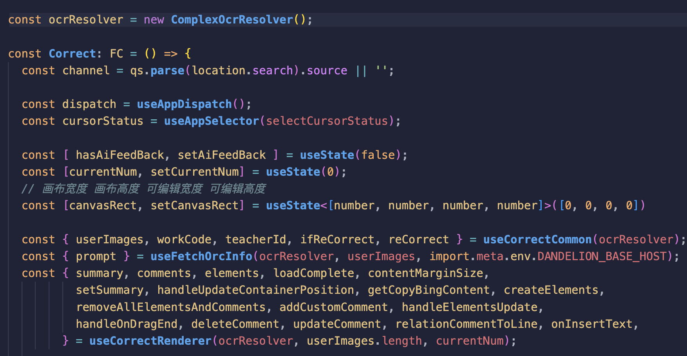

想到本次分享主题的背景是前段时间在逛Github时，无意中发现了Zova这个项目。Zova的项目定位是一款直观的前端框架，Zova的作者表示其在设计Zova时，汲取了前端三大框架的设计思想及精华，最终实现具有优雅、快速、可靠的新框架；实际上Zova项目star并不多，甚至还不到100star。这样的项目在前端，但当我耐下心来，仔细了解Zova这个框架的时候，还是觉得挺有意思的，值得聊一下；

[https://github.com/cabloy/zova](https://github.com/cabloy/zova)
<!--more-->


# 前端ioC容器

# 一、背景
想到本次分享主题的背景是前段时间在逛Github时，无意中发现了Zova这个项目。Zova的项目定位是一款直观的前端框架，Zova的作者表示其在设计Zova时，汲取了前端三大框架的设计思想及精华，最终实现具有优雅、快速、可靠的新框架；实际上Zova项目star并不多，甚至还不到100star。这样的项目在前端，但当我耐下心来，仔细了解Zova这个框架的时候，还是觉得挺有意思的，值得聊一下；

[https://github.com/cabloy/zova](https://github.com/cabloy/zova)

# 二、痛点

实际上，Zova吸引我的是其设计理念和我真正想要的前端开发方式如出一辙：**即前端项目应该区分为两层：即：视图层与逻辑层；**

这样的设计方式大家可能都比较认同，在平时的开发过程中，相信大家也在努力的将代码尽可能的划分开来，三大框架中也都有类似的特性支持我们进行隔离复用；比如React中的Hooks、Vue3中的Composition API、Angular中的Services；但看上去还是会经常遇到下面这个问题，即各层次的数据共享方式；



下面是一个React项目的代码片段，由于项目逻辑比较复杂，因此我们使用Hooks对项目的逻辑进行了封装，起初这样的封装方式可以尽可能的将逻辑内聚集中。但随着业务逻辑的复杂化，Hooks之间也最终也会存在关联关系，导致我们之前期望「高内聚、低耦合」的组织方式不再完美；这样仿佛成为了死结，是否有更好的解决方法呢？

# 三、Zova带来的思路

在前端的项目中总结起来大致有三类数据流，即：

1. 组件内部状态共享；
2. 组件之间状态共享；
3. 全局状态共享；

我们用Vue3项目作为对比：

| 场景 | Vue3 | Zova |
| --- | --- | --- |
| 组件内部状态共享 | Composable | IOC |
| 组件之间的状态共享 | Provide/Inject | IOC |
| 全局状态共享 | Pinia | IOC |

Vue3中需要Composable、引入状态管理等等，而在Zova中，只需要采用统一的 IOC 容器机制即可实现上面的三类数据流，IoC容器为何如此神奇呢？接下来我们便进入本此分享的主题：**依赖注入和控制反转**；

# 三、控制反转和依赖注入

首先要明确一点，控制反转是计算机软件设计中的一个设计模式，目的是可以通过这一设计思想，构建出高扩展性、解耦合的应用程序结构；

控制反转的核心思想是“反转”程序的控制权，将对象的创建和生命周期管理从调用者转移到框架或容器；

理论知识总是生涩难以理解，让我们尝试从一个例子切入，尝试了解控制反转的底层逻辑：

## 3.1 举个例子

小明上班几年了，终于攒下钱买了一辆小汽车。我们汽车之所以可以开起来，是动力系统驱动，而动力系统则是通过燃油燃烧提供的能量。因此小明在他的爱车中，实例化了一个`FuelEngine` 。

```tsx
abstract class Engine {
  getPower(energy: Energy): void;
  drive(): Horsepower;
}

class FuelEngine extends Engine {
  private power: Power;
	constructor() {
		super();
	}
	
	getPower(energy: Energy) {
		this.power = energy.getPower();
	}
	
	drive() {
		return fuelEngineHorsePower;
	}
}

class MyCar {
		private engine: Engine;
		constructor() {
			this.engine = new FuelEngine();
		}
		drive() {
			this.getPower(fuel);
			this.engine.drive();
		}
}

const xiaomaCar = new MyCar();
xiaomaCar.drive();
```

然而随着科技的发展，大街上的新能源车越来越多。小明被电车百公里3秒的推背感深深吸引，然而囊中羞涩，小明并没有预算去换一辆车。因此他打算自己动手，把自己车的动力系统更换成电机马达；在改装的第一时刻，小明便深深的体会到不易，想要改装自己的汽车实在是太困难了，需要在自己的的MyCar中，重新将汽车的引擎engine，重新在构造函数中，调整为 ElectricPowerEngine;这样的步骤相当于要将车拆开，到最底层替换动力系统；

```tsx
abstract class Engine {
  getPower(energy: Energy): void;
  drive(): Horsepower;
}

class ElectricEngine extends Engine {
  private power: Power;
	constructor() {
		super();
	}
	
	getPower(energy: Energy) {
		this.power = energy.getPower();
	}
	
	drive() {
		return fuelEngineHorsePower;
	}
}

class MyElectricCar {
		private engine: Engine;
		constructor() {
			this.engine = new ElectricEngine();
		}
		drive() {
			this.getPower(electric);
			this.engine.drive();
		}
}
```

小明很是懊恼，要是能用到大学时学习到的控制反转策略设计自己的汽车那该有多好！

```tsx
abstract class Engine {
  getPower(energy: Energy): void;
  drive(): Horsepower;
}

class ElectricEngine extends Engine {
  private power: Power;
	constructor() {
		super();
	}
	
	getPower(energy: Energy) {
		this.power = energy.getPower();
	}
	
	drive() {
		return fuelEngineHorsePower;
	}
}

class FuelEngine extends Engine {
  private power: Power;
	constructor() {
		super();
	}
	
	getPower(energy: Energy) {
		this.power = energy.getPower();
	}
	
	drive() {
		return fuelEngineHorsePower;
	}
}

class MyIOCCar {
		private engine: Engine;
		constructor(private readonly engine： Engine) {}
		drive(power) {
			this.getPower(electric);
			this.engine.drive();
		}
}

const electricCar = new MyIOCCar(new ElectricEngine());
const fuelCar = new MyIOCCar(new FuelEngine());
```

太好了，这样小明就可以随时调整自己车辆的驱动，当油价便宜的时候，小明的汽车是汽油车，当小明想追求加速度时，可以变更为小米su7！

有了上面这个生动的例子后，让我们从技术层面继续了解；

## 3.2 IoC

在开发中，控制反转的设计思路不同于以往传统的开发模式中所有依赖项都在内部显式实现的方式，而是通过放弃主动权被动接收外部注入的依赖。这样的设计方式就像小明在创建他的汽车的时候，不再一点点创建汽车的零部件，最后集中在Car类中实例化依赖，而是通过外部注入依赖的方式来被动获取；听上去好像好理解多了，但IoC真的只是简单的将

理解好 IoC 的关键是要明确 **“谁控制谁，控制什么，为何是反转，哪些方面反转了”**，我们来深入分析一下。

- 谁控制谁，控制什么：
在传统的程序设计中，我们直接在对象内部通过 `new` 的方式创建对象，是程序主动创建依赖对象；**而 IoC 是有专门一个容器来创建这些对象，即由 IoC 容器控制对象的创建**；
- 谁控制谁？
IoC 容器控制了应用程序用何种方式获取其依赖资源
- 哪些方面反转了？
有反转就有正转，传统应用程序是由我们自己在程序中主动控制去获取依赖对象，也就是正转；**而反转则是由容器来帮忙创建及注入依赖对象**；
- 为何是反转？
因为由容器帮我们查找及注入依赖对象，对象只是被动的接受依赖对象，所以是反转了；哪些方面反转了？依赖对象的获取被反转了。

其实 IoC 对编程带来的最大改变不是从代码上，而是思想上，发生了 “主从换位” 的变化。应用程序本来是老大，要获取什么资源都是主动出击，浪费了很多的心智负担，但在 IoC 思想中，应用程序就变成被动了，真正成为了甩手掌柜，在程序的运行时，被动的等待 IoC 容器来创建并注入它所需的资源；

## 3.3 依赖注入-DI

依赖注入是控制反转的实现方式之一，我们可以从依赖、注入分别理解 DI 的设计思想；其实很简单，应用程序依赖IOC容器提供的外部资源，例如对象、资源、常量；而IOC容器则提供一些办法，标记应用程序的依赖项，最后在应用程序要实例化时，注入应用程序需要的依赖。总的来说，DI是控制反转IOC的一个实现方式；

## 3.4 一图胜千言

### 3.4-1 未使用IoC的项目架构


### 3.4-2 使用IoC的项目架构


## 3.5 IoC在前端生态中的应用

在前端生态中，其实有很多的项目有使用到IoC的开发模式，例如Angular中：

```tsx
import { Injectable, ReflectiveInjector } from '@angular/core';

// 配置Provider
@Injectable({
  providedIn: 'root',
})
export class Body {}

@Injectable({
  providedIn: 'root',
})
export class Chassis {}

@Injectable({
  providedIn: 'root',
})
export class Engine {
  start() {
    console.log('启动！');
  }
}

@Injectable()
export default class Car {
  // 使用构造注入方式注入依赖对象
  constructor(
    private engine: Engine,
    private body: Body,
    private chassis: Chassis
  ) {}

  run() {
    this.engine.start();
  }
}

const injector = ReflectiveInjector.resolveAndCreate([
  Car,
  Engine,
  Chassis,
  Body,
]);

const car = injector.get(Car);
car.run();
```

或者大家更为熟悉的Nestjs服务架构，可能经常会用到Injectable、Inject来标注类或者变量；

```tsx
import axios from 'axios';
import { Injectable, Inject } from '@nestjs/common';
import { WINSTON_MODULE_NEST_PROVIDER } from 'nest-winston';
import { Observable, catchError, from, map, mergeMap, throwError } from 'rxjs';

import type { LoggerService } from '@nestjs/common';
import type { AxiosRequestConfig, AxiosResponse } from 'axios';

@Injectable()
export class AxiosRxjsService {
    constructor(@Inject(WINSTON_MODULE_NEST_PROVIDER) private readonly logger: LoggerService) {
        axios.interceptors.request.use((config) => {
          config.timeout = 180000;
          return config;
        });
    
        axios.interceptors.response.use((response: AxiosResponse) => {
          return response.data;
        });
    }

    get<T>(url: string, config?: AxiosRequestConfig): Observable<T> {

    }

    post<T>(url: string, data?: any, config?: AxiosRequestConfig): Observable<T> {
        return from(axios.post<T>(url, data, config)).pipe(
          map((response: AxiosResponse<T> & {
            code: number;
            msg: string;
          }) => {
            if (response.code !== 0) {
              throw new Error(response.msg);
            }
            return response.data;
          }),
          catchError((err) => {
            this.logger.error(err);
            return throwError(() => err);
          })
        );
      }
    
    put<T>(url: string, data?: any, config?: AxiosRequestConfig): Observable<T> {
        return from(axios.put<T>(url, data, config)).pipe(
            map((response: AxiosResponse<T>) => response.data),
        );
    }

    streamPost<T, D = unknown> (
      url: string,
      data: D,
      config?: AxiosRequestConfig
    ) {
      return from(
        fetch(url, {
          method: 'POST',
          headers: (config || {}).headers as HeadersInit,
          body: JSON.stringify(data),
        })
      ).pipe(
        mergeMap(async (response) => {
          if (!response.body) {
            throw new Error('Response body is undefined');
          }
    
          const reader = response.body.getReader();
          const text_decoder = new TextDecoder('utf-8');
          let temp_str = '';
          const chunks: T[] = [];
          let chunk_str = '';
    
          while (true) {
            const { done, value } = await reader.read();
    
            if (done) {
              temp_str.split(/(\r\n|\r|\n){2}/g).forEach((part) => {
                  if (part.trim().length === 0) {
                    const data = this._parseEventChunk(chunk_str.trim());
                    if (data) {
                      chunks.push(data as T);
                    }
                    chunk_str = '';
                  } else {
                    chunk_str += part;
                  }
                },
              );
              return chunks;
            }
            const decode_result = text_decoder.decode(value);
            temp_str += decode_result;
          }
        }),
      );
    }

    private _parseEventChunk = function (chunk) {
      if (!chunk || chunk.length === 0) {
        return null;
      }
      const FIELD_SEPARATOR = ':'
      let e = { id: null, retry: null, data: '', event: 'message' };
      chunk.split(/\n|\r\n|\r/).forEach((line) => {
          line = line.trimRight();
          let index = line.indexOf(FIELD_SEPARATOR);
          if (index <= 0) {
            return;
          }
  
          let field = line.substring(0, index);
          if (!(field in e)) {
            return;
          }
  
          let value = line.substring(index + 1).trimLeft();
          if (field === 'data') {
            e[field] += value;
          } else {
            e[field] = value;
          }
        },
      );
  
      return {
        id: e.id,
        data: e.data,
      };
    }
}
```

## 3.6 IoC是如何实现的

我们简单实现一个IoC容器，期望可以通过Injectable以及inject实现一个最简单的IoC容器；

首先要实现IoC容器，需要对装饰器于reflect-metadata有一些了解，在团队之前的分享中，已经有老师介绍到了装饰器，大家感兴趣的可以回顾一下：

[https://yach-doc-shimo.zhiyinlou.com/docs/5xkGMQGgzrU98d3X/](https://yach-doc-shimo.zhiyinlou.com/docs/5xkGMQGgzrU98d3X/) 《typescript&nest.js装饰器》

而reflect-metadata则是一种元数据的绑定方式：我们可以通过reflect-metadata为类注入元信息；元信息的用途我们后续会介绍到；

[npm: reflect-metadata](https://www.npmjs.com/package/reflect-metadata)


### 3.6.1 声明IoC Container

```tsx
interface Type<T> extends Function {
  new (...args: any[]): T;
}

class InjectionToken {
  constructor(public injectionIdentifier: string) {}
}

type Token<T> = Type<T> | InjectionToken;

class Container {
  addProvider<T>(provider: Provider<T>) {} // TODO
  inject<T>(type: Token<T>): T {} // TODO
}
```

### 3.6.2 定义三类Provider - 类Provider 值Provider 工厂函数Provider

```tsx
export type Factory<T> = () => T;

export interface BaseProvider<T> {
  provide: Token<T>;
}

export interface ClassProvider<T> extends BaseProvider<T> {
  provide: Token<T>;
  useClass: Type<T>;
}

export interface ValueProvider<T> extends BaseProvider<T> {
  provide: Token<T>;
  useValue: T;
}

export interface FactoryProvider<T> extends BaseProvider<T> {
  provide: Token<T>;
  useFactory: Factory<T>;
}

export type Provider<T> =
  | ClassProvider<T>
  | ValueProvider<T>
  | FactoryProvider<T>;
```

### 3.6.3 Injectable装饰器

```tsx
declare type ClassDecorator = <TFunction extends Function>(target: TFunction) 
  => TFunction | void;
```

标识可被注入依赖的类：

```tsx
import { Type } from "./type";
import "reflect-metadata";

const INJECTABLE_METADATA_KEY = Symbol("INJECTABLE_KEY");

export function Injectable() {
  return function(target: any) {
    Reflect.defineMetadata(INJECTABLE_METADATA_KEY, true, target);
    return target;
  };
}
```

### 3.6.4 Inject装饰器

```tsx
declare type ParameterDecorator = (target: Object, 
  propertyKey: string | symbol, parameterIndex: number ) => void
```

```tsx
import { Token } from './provider';
import 'reflect-metadata';

const INJECT_METADATA_KEY = Symbol('INJECT_KEY');

export function Inject(token: Token<any>) {
  return function(target: any, _: string | symbol, index: number) {
    Reflect.defineMetadata(INJECT_METADATA_KEY, token, target, `index-${index}`);
    return target;
  };
}
```

有了上面的准备，我们可以正式开始开发IoC容器：

```tsx
// container.ts
type InjectableParam = Type<any>;

const REFLECT_PARAMS = "design:paramtypes";

export class Container {
	// 收集所有注入的数据
  private providers = new Map<Token<any>, Provider<any>>();
	
  addProvider<T>(provider: Provider<T>) {
    this.assertInjectableIfClassProvider(provider);
    this.providers.set(provider.provide, provider);
  }

  inject<T>(type: Token<T>): T {
    let provider = this.providers.get(type);
    if (provider === undefined && !(type instanceof InjectionToken)) {
      provider = { provide: type, useClass: type };
      this.assertInjectableIfClassProvider(provider);
    }
    return this.injectWithProvider(type, provider);
  }

  private injectWithProvider<T>(type: Token<T>, provider?: Provider<T>): T {
    if (provider === undefined) {
      throw new Error(`No provider for type ${this.getTokenName(type)}`);
    }
    if (isClassProvider(provider)) {
      return this.injectClass(provider as ClassProvider<T>);
    } else if (isValueProvider(provider)) {
      return this.injectValue(provider as ValueProvider<T>);
    } else {
      // Factory provider by process of elimination
      return this.injectFactory(provider as FactoryProvider<T>);
    }
  }

  private assertInjectableIfClassProvider<T>(provider: Provider<T>) {
    if (isClassProvider(provider) && !isInjectable(provider.useClass)) {
      throw new Error(
        `Cannot provide ${this.getTokenName(
          provider.provide
        )} using class ${this.getTokenName(
          provider.useClass
        )}, ${this.getTokenName(provider.useClass)} isn't injectable`
      );
    }
  }

  private injectClass<T>(classProvider: ClassProvider<T>): T {
    const target = classProvider.useClass;
    const params = this.getInjectedParams(target);
    return Reflect.construct(target, params);
  }

  private injectValue<T>(valueProvider: ValueProvider<T>): T {
    return valueProvider.useValue;
  }

  private injectFactory<T>(valueProvider: FactoryProvider<T>): T {
    return valueProvider.useFactory();
  }

  private getInjectedParams<T>(target: Type<T>) {
    const argTypes = Reflect.getMetadata(REFLECT_PARAMS, target) as (
      | InjectableParam
      | undefined
    )[];
    if (argTypes === undefined) {
      return [];
    }
    return argTypes.map((argType, index) => {
      // The reflect-metadata API fails on circular dependencies, and will return undefined
      // for the argument instead.
      if (argType === undefined) {
        throw new Error(
          `Injection error. Recursive dependency detected in constructor for type ${target.name} 
             with parameter at index ${index}`
        );
      }
      const overrideToken = getInjectionToken(target, index);
      const actualToken = overrideToken === undefined ? argType : overrideToken;
      let provider = this.providers.get(actualToken);
      return this.injectWithProvider(actualToken, provider);
    });
  }
  
  private isInjectable<T>(target: Type<T>) {
	  return Reflect.getMetadata(INJECTABLE_METADATA_KEY, target) === true;
	}

  private getTokenName<T>(token: Token<T>) {
    return token instanceof InjectionToken
      ? token.injectionIdentifier
      : token.name;
  }
}

const container = new Container();
container.addProvider({
	type: 'WinSTON',
	useClass: Service,
})

container.inject({
"type":"WINSTON"
})
```

# 四、结论

软件设计模式在开发中还是较为重要的，我们需要在保证不过度设计的原则下，用设计模式的优势优化我们项目的代码；