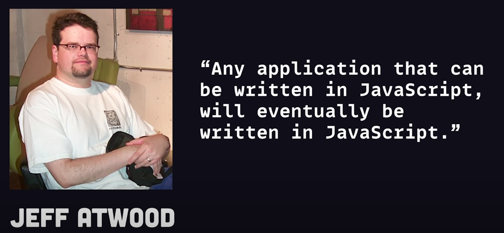

任何可以使用JavaScript来编写的应用，最终会由JavaScript编写
<!--more-->

# 大话Node.js

# 前言

> Node.js是一个基于V8 JavaScript引擎的JavaScript运行时环境，我对本次分享的定位并非是深挖其底层各类架构，而是希望可以通过将Nodejs向研发团队中不同岗位的同学布道，为大家在面临技术选型的时刻，有更多的选项；



**任何可以使用JavaScript来编写的应用，最终会由JavaScript编写。**

上来就抛出如此暴论并非引战，也无意和php Battle谁是世界上最好的语言。


引用Atwood定律只是想侧面反映出，在前端技术高速发展的时代浪潮下，人们对JavaScript这一语言的美好的期望。

# 1. 滔滔不绝的技术浪潮

开篇提到，千禧年初人们对JavaScript有着无限的期待。其中横空出世的Nodejs的出现更是使得JavaScript不再局限于浏览器内的脚本执行，而是可以运行在服务器端，这一变化仿佛又加速了Atwood定律的实现。

想聊Nodejs，就不能不提到JavaScript。前端同学都知道，最开始时JavaScript仅仅是作为处理例如：浏览器表单校验的简单脚本。


运行在早期Netscape浏览器中JavaScript

上面原始的界面仿佛把我拉回到了十多年前的学校机房，不过谢天谢地！


自Ajax技术诞生后，网页承载的能力愈发复杂，JavaScript担负起了更复杂的功能实现；我们前端终于摘掉了切图仔的帽子，也避免了被鸡抢工作的尴尬局面；


但JavaScript从设计初始便存在一些问题，例如解释型语言在性能上的原罪。JavaScript、Python等程序在运行时需要逐行解释代码。而编译型语言例如C、Golang在执行时已经编译为机器码，可直接执行。这导致解释型语言在执行速度和运行开销上天生不如编译型语言。

直到Chrome V8引擎的出现，其使用的JIT编译优化、高效的垃圾回收策略技术给Chrome浏览器带来了一颗强劲的心脏。

- 跑偏题让我们聊聊前端JIT和AOT
    - JIT：Just in Time 指在运行时编译，边运行边编译，比如Java虚拟机在运行时就用到JIT 技术
    - AOT：Ahead of Time 指在运行前编译，比如普通的静态编译
    
    无论是JIT和AOT都是一种**编译策略**策略，在不同环境，不同语言中有不同方式，在这里我们短时间快速的讨论下前端编译中的编译优化：
    
    - AOT：个人在前端中接触AOT，最主要的是Vue中的模版优化。为了让不同base的老师都可以理解，用最通俗的语言去解释：
    当页面内容发生变化时，为了尽可能保证性能，需要对变更前后进行diff对比，找出真正需要变动的页面内容区域，从而进行局部补丁更新。这里面时间复杂度最高的便是diff算法（尽管已经做过各类优化）。在Vue3中采用了一些针对模版语法的静态优化策略，依靠Template规则化的语法，找出静态AST，也就是不存在响应数据绑定的分支，重复复用。这也就是经常提到的“PatchFlag-静态标记”以及“StaticElevate-静态提升”;
    - JIT: 简单来说，九个字，打标签！加缓存！预优化！
    在V8 Engine中加入了一个 Monitor，用来观察运行的代码。并记录下每段代码运行的次数和代码中的变量的类型。例如下面的代码：一开始只是通过解释器正常执行，当某一行代码被执行了几次，这行代码会被打上 **Warm** 的标签；当某一行代码被执行了很多次，这行代码会被打上 **Hot** 的标签。
    1. 代码片段传递给**Compiler** 编译且储存，同时按照**行数**和**变量类型**被索引存储；后续当发现执行的代码命中索引，会直接取出编译后的代码执行。从而不需要重复编译已经编译过的代码；
    2. 被打上 **Hot** 标签的代码会被传给 **Optimizing Compiler**，这里会对这部分带码做更优化的编译。
    
    ```jsx
    function arraySum(arr) {
      var sum = 0;
      for (var i = 0; i < arr.length; i++) {
        sum += arr[i];
      }
    }
    ```
    

回归正传，由于上面提到的和没有提到的一系列优化、使JavaScript最种成为了一个成熟的语言。而这些，也决定了Nodejs之父Ryan Dahl选择JavaScript、选择V8 Engine作为Nodejs的寄生语言；


**膜拜祖师爷**

下面是代码在Node与Chrome运行时的架构图。可以很明显的看出，Nodejs与浏览器环境最大的区别仅仅是Nodejs环境在剥离了视图层的相关解析模块。


**Node与浏览器环境的架构异同点**

# 2. Nodejs的应用场景

1. Web服务器
    
    Express.js、Nest.js、Koa.js。Nodejs的服务端框架数量众多。用上述的框架，你可以快速的启动一个后端服务，也可以用集成度更高的Next.js、Nuxtjs搭建一套SSR服务；
    
    目前在希望学的Nodejs生态中，大多数服务均选择使用Nestjs作为技术栈首选；
    
2. 天然支持微服务架构
    
    Node.js 是轻量级的，启动时间快，占用资源少。这使得 Node.js 编写的微服务可以快速启动和重启，支持快速迭代和部署，适应微服务架构中频繁的部署和更新需求。
    
3. 工具和脚本
    
    Node.js 可以用于开发各类自动化任务、脚本。例如前端自动化测试架构：Jest、Cypress**。**还有各类脚手架，如@Dandelion、构建工具。
    
4. 爬虫工具
    
    Node.js继承于JavaScript，天然对网页有特殊的优势。Node.js中Puppeteer、Cheerio可以快速的对网页内容DOM进行解析和渲染。
    
5. AI
    
    Callback下上期豆总的分享内容；
    

# 3. Node.js的优劣势

**优势：**

1. 基于 JavaScript 的统一语言：Node.js 使用 JavaScript 作为开发语言，使得前端和后端开发都可以使用同一种语言进行开发，从而提高了开发效率和代码可维护性。（感觉这个是大家上手Node.js的最基本原因😂）；
2. 丰富的模块库：Node.js 的生态系统非常丰富，拥有大量的第三方模块，使得开发者可以快速构建出各种类型的应用。
3. 轻量级和易于部署：Node.js 采用模块化开发方式，使得应用程序可以轻松地分解成小模块，从而提高了可维护性和可扩展性。同时，Node.js 的应用程序可以轻松地部署到各种云端平台上。

**劣势：**

当然 「Nodejs」 虽然很强大，但是也有很多问题：

1. CPU 密集型任务表现不佳：由于 Node.js 的单线程模型，当需要进行大量的 CPU 密集型计算时，会出现性能瓶颈，导致程序的运行效率下降。
2. Ryan Dahl控诉的 Node.js “七宗罪”。其中涵盖安全、回调地狱等等；其中大家可能执念最深的便是node_modules；上一个前端圈最经典的梗图；


大家可能也知道，目前有新兴的语言想要替代Nodejs。其中包括Ryan Dahl推出的Denojs、Bunjs等等；

例如Bunjs，对比Bunjs和Node在启动一个Vite服务；bunjs的速度要比node快将近80倍。


然而那又怎样呢，在我看来，任何语言都是有局限性的，bun速度的优势会随着语言的发展会有属于它的问题。而Node的生态决定了它在未来可见的时间中，仍占主流位置；Denojs、Bunjs 还很年轻！虽然他们的理想很丰富，但还需要经过时间的考验。

# 4. Node.js的银弹

## 4.1 单线程

Node.js 是单线程的，这意味着它只有一个主线程来处理所有的请求。与传统的多线程服务器（如 Apache）不同，Node.js 并不会为每个请求创建一个新的线程。相反，它使用一个主线程来处理所有的请求。

这样看上去，Nodejs没办法充分利用目前的多核服务，非也非也。


大家可能使用过PM2，PM2不仅仅是一个进程守护，更可以开启集群Cluster模式，根据宿主环境CPU数量进行扩展，伸缩后的应用程序的子进程就可以自动共享服务器端口。

### **4.1.1 主从策略**

PM2的实现底层原理还是通过Node.js 支持的child_process、或Cluster模块。在目前的服务中，也大量使用了主从架构；以Cluster为例，Cluster模块可以让我们轻松地创建多个子进程，并且提供了一些方法和事件来控制和通信。使用Cluster模块的基本步骤如下：


在fork子进程后，Cluster 模块使用内置的负载均衡来更好地处理线程之间的压力。通过负载均衡内部算法（Round-robin）。将所有传入的连接请求按结果通过IPC进程间通信发送给选中的工作进程；

上面大致简单分享了集群化的实现方式，最终Nodejs可以实现：

- **充分利用多核CPU资源**：通过将任务分配给多个子进程，可以充分利用多核CPU资源，提高整体性能。
- **隔离性**：子进程之间相互独立，一个子进程的崩溃不会影响其他子进程。

## 4.2 异步I/O

在PHP等语言中，使用的往往是阻塞性I/O，例如应用层执行


## 4.3 事件驱动架构

Node.js 是事件驱动的。这意味着它通过事件和回调机制来处理任务。当一个任务完成时，Node.js 会触发一个事件，并调用相应的回调函数。这使得 Node.js 能够在等待 I/O 操作完成时，继续处理其他任务，而不必一直阻塞在等待的任务上。

# 5. Nodejs在希望学研发架构中的实践

在目前希望学的研发架构中，我们也在尝试在一些业务中接入Nodejs。

### 5.1 订餐系统

订餐系统应该是目前大家接触最多的项目，它担负着目前公司的订餐能力。从管理后台餐品信息、权限管理，到C端餐品登记、验餐、乃至核销工具，均由Nodejs提供服务支持。不夸张的说订餐系统的稳定与否，决定着大家晚上吃什么。


### 5.2 AI批改-预批改服务


目前批改端教师工具中，支持对学员提交的作文进行智能批改。但由于Ai接口速度响应速度令人发指，一篇文章的响应时间往往要2分钟左右，对于老师的体验感较差。因此我们考虑通过预批改的方式，将批改行为前置。

AI预批改服务由Nodejs服务支持，其底层逻辑为Nodejs服务消费上游服务推送过来的Kafka数据进行批改消费，完成消费后将批改结果落库。后续老师再次访问时，只需查询数据库中结果即可。

### 5.3 TA智能跟课图片服务


TA智能跟课是目前持续迭代的教师自动化工具。作为一个自动化助手，目标以课程为周期，在关键节点向主讲老师、班主任、学员、家长自动推送消息。其中在关键节点，需要为学员、班级群动态生成图片，该功能同样由Nodejs服务实现；

最初，我们希望通过Puppeteer无头浏览器对H5页面进行截图从而生成图片。但在对接口进行压测中发现，Puppeteer或Puppeteer-Cluster截图或打开tab的时间过长，就算是扩容到几十台Pod，也无法满足QPS5000的业务量级，因此只能放弃该方案。

最终图片服务采用node-canvas的模式进行图片生成。其底层原理实际上是以Python图像工具作为libuv，Nodejs作为上层暴露调用接口实现与浏览器中canvas一致的调用API。

### 5.4 静态资源管理平台

静态资源平台是目前平台组万军、志伟老师开发的一套资源管理服务。目前还在不断的迭代过程中，欢迎大家使用并提出宝贵的意见：[https://file.xue.xiwang.com/#/staticCommon](https://file.xue.xiwang.com/#/staticCommon)


### 5.5 各类爬虫工具

之前提到，Node.js天然对网页有特殊的优势。我们在爬虫方面也有一些尝试。例如晨霞老师开发维护的每周推送机器人，在每周五陪伴大家。还有一些商业爬虫，类似小红书数据爬虫。但随着小红书各类反爬策略的变更，会触发封禁；可以有更复杂的方式进行反爬，例如js逆向；


# 6. 未来的更多可能性

其实，在上面列举的一系列业务中使用Nodejs的过程里，我们团队内也一直在思考，究竟该在什么场景、什么业务中可以使用Nodejs。又如何可以在最大程度上发挥Nodejs和人的能力？

就我个人来说，以目前公司的业务架构，Nodejs还是需要在非核心业务、非稳定性要求高的服务下发挥作用。我们想到了一些未来可以深入发力的切入点，在这里和大家分享。抛砖引玉，希望可以给大家带来更多的思路；

## 6.1 **GraphQL**

GraphQL 是一种用于 API 的查询语言，允许客户端精确地请求他们所需要的数据，并且仅返回这些数据。与传统的 REST API 不同，GraphQL 通过单个端点提供了强大的查询和数据操作能力。

### 6.1-1 优势

1. 精确的数据请求

- 减少冗余数据：客户端可以指定需要的数据字段，从而避免了过多的冗余数据传输。这提高了网络效率，尤其是在移动设备上。
- 避免过少数据：客户端能够在一次请求中获取所需的所有数据，而不需要多个 API 请求。

2. 强大的查询能力

- 灵活的查询：客户端可以通过查询语法动态地组合数据，从而支持复杂的数据需求。

3. 自动文档和强类型系统

- 强类型系统：GraphQL 的类型系统确保了请求和响应的数据结构的一致性，减少了错误。

### **6.1-2 使用场景**

1. 数据密集型应用

对于需要大量数据交互的应用，如数据仪表盘和报告系统，GraphQL 提供了灵活高效的数据获取方式。

2. 复杂关系数据

当应用涉及复杂的数据关系时，GraphQL 能够通过嵌套查询轻松获取关联数据，避免多次请求。

3. 跨平台应用

对于同时支持 Web、iOS 和 Android 的跨平台应用，GraphQL 能够统一 API 接口，减少开发和维护成本。

## 6.2 BFF层

BFF层，顾名思义，是一种架构模式，其目的是为了简化和优化前端与后端之间的交互。BFF层的设计初衷是为每个前端应用（如移动应用、Web应用、桌面应用等）提供专门的后端服务。

想想这样一个业务场景，随着业务的增长，TA的桌面端已经无法满足老师们日益增长的需求，我们需要推出移动端等应用。由于不同端的展现形式不同，TA Web端原有的接口从数据结构、获取的信息维度已经无法支持，但如果为每一个环境单独开发一套接口，又多了太多的开发成本。此时，我们在Client与Server间，新增一个BFF层。BFF架构旨在为前端应用提供一个统一的接口层，将统一的接口进行结构化处理，最终不同设备提供不同API接口；


## 6.3 **TRPC**

公司目前在前端的技术栈中，基本所有项目都接入了TypeScript，强类型的语法可以在开发期间避免需要低级错误，也便于后续项目的维护。

大家可能都遇到过，与后端进行联调时，即时是做到了前后端全栈开发，在开发项目时，同一个接口，也要编写两遍类型声明。这时候，TRPC可能是你的一个不错的选择；

TRPC框架提供了一种在前后端之间进行类型安全的远程过程调用（RPC）的方法，基于TRPC搭建的全栈项目可以直接在客户端和服务器之间共享类型，而无需依赖代码生成。

目前订餐系统、资源管理平台均是基于TRPC架构进行开发；

[https://trpc.nodejs.cn/v10-dark-landscape.mp4](https://trpc.nodejs.cn/v10-dark-landscape.mp4)