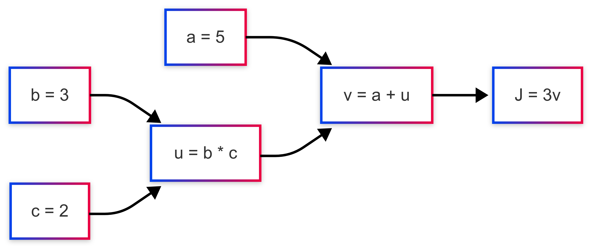

在中文互联网中，大家可能经常会听到“对xx去魅”。举个例子，小A心中有个女神，小A每天光看女神朋友圈光鲜艳丽的生活点滴和ootd，深深感受到女神的高贵冷艳，连点个赞都要斟酌半天。

但后来小A鼓起勇气一聊天，发现女神也在为组内技术分享发愁、还在纠结晚饭到底是吃沙拉保持形象，还是干脆炸鸡配可乐快乐过活。。。

这时候小A恍然大悟：原来女神也不过是个在打工生活中挣扎的牛马，和自己没什么两样。所谓“神秘感”，大多时候不过是滤镜和距离感叠加的产物。

所以今天我们也鼓起勇气，今天来“去魅”的对象，是神经网络。它被称为AI时代的引擎，但它其实没你想的那么神秘

当然，也没那么简单。

本次分享主要围绕神经网络的基本知识—逻辑回归模型进行分享。也算是抛砖引玉，希望可以借助本次分享，帮助大家对神经网络有所了解，激起大家对AI领域的兴趣；最后如果时间充裕，将会带大家一起训练一个逻辑回归模型；

<!--more-->

# 1. 什么是深度学习

什么是深度学习？？


这个名词看上去确实很深奥。学习本身就很痛苦了，深度学习不更痛苦？

对我而言，回想最开始，我对他的第一印象，可能是黑客帝国或是神秘博士。


但实际上，深度学习是一种**模拟人脑神经网络**的机器学习方法，它通过构建多层的“神经元”网络，让计算机自动从大量数据中学习出特征和模式，从而完成复杂任务。比如**语音识别**、**图像识别**、**自然语言处理**、**自动驾驶**等等。

用一句话来概括，就是让计算机通过多层“感知器”自主学习数据特征，像人脑一样“理解”世界。

上面我们了解到何为深度学习，其中，我对「**模拟人脑神经网络**」加粗展示了。深度学习是如何模拟人脑神经网络的呢，这就引出了我们接下来要重点聊到的：神经网络；

# 2. 神经网络

## 2.1 人类的大脑是如何分析世界的？

要想知道深度学习是如何仿真人脑的，我们不妨先了解下人类大脑的工作流程：

**人脑是由大约 860 亿个神经元组成：**

其中每个神经元大致包含：

- **树突**：接收信号
- **细胞体**：处理输入
- **轴突**：输出信号给其他神经元
- **突触**：两个神经元之间的连接点，用于传输信息


神经元的处理流程可以理解为：`多个输入信号 → 汇总 → 达到“阈值” → 发出电信号`

总结来说：神经元只有在输入足够**强**时，才会被**激活**并传递信号。

简单的讲，就是通过上述这样的一个个神经元相互联结，当一层神经元识别激活时，通过电、化学信号传递到下一层神经元，反复操作，最终支持人脑对外界事物的处理；

## 2.2 神经网络是如何模拟人脑的？

从前面的内容中，我们可以看到人脑神经元工作流程：输入信号→处理→输出。深度学习的神经网络也是模拟了这个过程，只是把生物学上的神经元抽象为数学模型。

在人工神经网络中，也有类似人脑神经元的概念：

- **输入层**：接收原始数据，类似于神经元的树突
- **隐藏层**：处理信息的中间层，可以有多层，类似于神经元的细胞体
- **输出层**：产生最终结果，类似于神经元的轴突
- **权重和偏置**：模拟突触的强度，决定信号传递的重要性
- **激活函数**：决定是否"激活"神经元，类似于神经元的阈值机制

其实，上述名词现在讲起来还比较闭塞，但不要着急，接下来我们将通过现实生活中的例子一步步带你了解；

## 2.3 什么是神经网络

在上文我们主要关注的是，机器学习神经网络是如何模拟人脑去工作的，接下来我将给出个人对神经网络的理解：

神经网络即训练神经网络，是通过已有数据集（特征 * n & 实际结果），经过迭代调整权重、偏置，拟合一个能反映输入与输出关系的函数。最终你只需要给入参，便可以得到符合数据集特征的最终推导结果；

讲起来是不是还是有些抽象，没关系，第四章我们会用一个现实生活中的例子来切入；

## 2.4 神经网络的应用场景

### 2.4.1 逻辑回归场景 — 本次分享重点方向

逻辑回归是理解神经网络的关键一步。它既可以看作是神经网络的“单个神经元”，也是很多实际问题中的有效解决方案。

- **广告点击率预测**：输入特征：用户年龄、性别、兴趣、广告类型等，输出结果：是否点击广告（1 或 0）
- **信用评分与风险评估**：银行或金融机构评估一个用户是否会违约
- **疾病预测**：医疗场景中，用患者体检数据预测是否患病

### 2.4.2 图像识别，自动打标

图像识别是神经网络最成功的应用之一，尤其是在卷积神经网络（CNN）广泛使用之后。

- **图像分类**：判断图片中是什么，如猫、狗、汽车等。
- **目标检测**：找出图像中所有感兴趣的物体及其位置（如YOLO、Faster R-CNN）。
- **图像打标**：自动给图片加上标签（如“风景”、“人像”、“鉴黄”等），广泛应用于图像管理和内容审核。

### 2.4.3 音频处理：语音转文字

在语音识别领域，RNN架构模型的出现极大提升了准确率。

- **自动语音识别（ASR）**：将语音内容转换成文字，常见于手机语音输入、智能音箱、会议纪要生成等。
- **关键技术**：RNN、LSTM、Transformer 等序列模型；CTC 损失函数；注意力机制。
- **应用产品**：苹果 Siri、科大讯飞、腾讯会议自动转写等。

### 2.4.4 机器翻译

神经网络也彻底变革了自然语言处理中的翻译任务。

- **神经机器翻译（NMT）**：利用编码器-解码器结构，直接学习源语言与目标语言之间的映射。
- **Transformer 模型**：极大提高了翻译质量和速度（如 Google 的 BERT、OpenAI 的 GPT 等均基于该结构）。
- **特点**：支持上下文理解、灵活处理长文本、支持多语言。
- **现实应用**：Google Translate、百度翻译、DeepL。

### 2.4.5 自动驾驶

自动驾驶是神经网络集大成的应用场景，融合了感知、决策、控制多个模块。

- **视觉感知**：使用 CNN 进行图像识别，实现车道线识别、交通标志识别、行人检测等。
- **行为预测**：使用 RNN、Transformer 预测周围车辆或行人的未来行为。
- **路径规划与控制**：强化学习用于优化路径决策。
- **领先公司**：Tesla、Waymo、小鹏、华为等都在用深度学习模型构建自动驾驶系统。

例如特斯拉FSD方案：使用CNN作为**初级感知层，利用**使用**时序Transformer**进行帧间理解，从而运动跟踪、路径预测。

# 3. 🌰：CTR 预估—**广告点击预测**

举个现实生活中真实的场景：在高使用率的应用上，广告的成本越来越高。CTR数据即影响着我们广告投送的效果，也关联着广告主、广告商的投放效果和实际收益，这一点可能增长方向的老师们比较敏感。

那广告商是如何将我们的广告投送给**目标潜在用户**，从而提高CTR点击率的呢？这就用到了我们本次重点内容—逻辑回归；

往往在投放前，广告商可以给：给定一条广告 + 一个用户 + 当前上下文，**预测用户会不会点击**，输出一个概率。即CTR预估；

例如：

给定场景输入：用户 A，看到广告 X（化妆品广告），现在是晚上 9 点

输出：CTR = 0.23，说明有 23% 的可能性会点击；

我们简单分析下，可能会考虑到的维度：

**用户侧特征**

1. 性别
2. 年龄
3. 兴趣标签
4. 历史点击记录
5. 搜索记录
6. 购买记录

**广告侧特征**

1. 广告类型
2. 商品价格

**上下文**

1. 访问时间
2. 页面场景
3. 设备类型

以上的维度，配合先前的大量用户记录—埋点、订单信息等等，可以推导出用户点击的概率；

# 4. 神经网络底层实现分类

神经网络理论从诞生以来，根据不同的应用场景，出现许多种实现方案。列举几个较为流行的架构，我们快速介绍下，大家有概念即可。

## 4.1 CNN 卷积神经网络

CNN 常用于对图片的识别。例如我们常用的OCR、试卷拆题服务，均是由该类型神经网络实现的；例如识别图像中人类，如下图所示：


他是一种**模仿人类视觉系统**的神经网络，通过**卷积核滑动提取局部特征**，逐层提取越来越抽象的信息，最终实现分类或回归等任务。CNN的工作流程如下：


## 4.2 RNN & RNNS 循环神经网络

RNN 是一种**擅长处理序列数据**的神经网络，它的神奇之处在于能**记住之前的输入信息**，用于后续的预测，比如：

1. 一段文字、一句话的语义理解；
2. 一串时间序列的趋势分析；
3. 一个音频的情感判断；
4. 音频转文字

RNN的基本算法可以概括为：

$$
h_t = tanh(W_xh * x_t + W_hh * h_{t-1} + b)
$$

我们以判断一段话正负反馈为例：「分析句子“我今天心情很好”」，我们希望模型判断它是**正面情感；**模型是如何实现的呢？

1. 处理输入数据，token切割；这类切割方式与后续的Transformer架构分词不同，依靠预置的字典；
x1 = "我"
x2 = "今天"
x3 = "好"
x4 = "开心"
2. 每一步计算一个隐藏状态：
    
    h1 = RNN(x1, h0)
    h2 = RNN(x2, h1)
    h3 = RNN(x3, h2)
    h4 = RNN(x4, h3)
    
3. 最后一个隐藏状态 h4，认为代表整句话的语义，拿来做分类：
    
    y = Linear(h4) → $Softmax$ → 情感类别
    

从上面来看，RNN在处理序列化的数据时，是有“记忆”的能力的，但如果语句长度长，之前的特征会被逐步稀释，这也就是：模型记忆梯度消失的问题所在。

为了解决这个问题，科学家引入新的架构：Transformer；

## 4.3 Transformer架构

Transformer可能是大家平时接触最多的大模型架构，目前市面上的几乎所有LLM模型，都是基于这一架构实现；Transformer理论起源于Google 2017 年的论文《Attention is All You Need》，为了解决RNN记忆消失的根本问题，Transformer**不再依赖循环（RNN），而是一次性看到整个输入序列，并建模所有位置之间的关系。也就是说，**Transformer的自注意力机制，并不是RNN那样从语序开始到结束一次次的累积，而是每一个分词都会关注句子中的其他词；

- 扩展：分词器
    
    大模型把一串文字“我们来学习一下神经网络”，利用分词器，解析为子词。将子词进行Embeding（预训练），寻找相似语义。就像：「我刚买了个 Snorkletrax，真香！」，虽然你从没听过“Snorkletrax”，但你能猜出来：
    
    - 它是个“可以买的”东西
    - “真香”说明它很棒
    - 所以前后文帮你理解这个新词是个“不错的新玩意儿”
    
    [Tiktokenizer](https://tiktokenizer.vercel.app/?model=Qwen%2FQwen2.5-72B)
    

## 4.4 小结一下

总体来讲，神经网络适用于各类场景，支持结构化数据和非结构化数据；

其中序列化数据，可以是csv，也可以是数据库中的数据；非结构化的数据类似于图像识别中的像素点、音频波动、或者是文本类；

在上面的前四章，我们了解了何为深度学习、何为神经网络、神经网络能做什么、神经网络的实现方案。接下来，我们由简入深，学习神经网络中的基础：**逻辑回归；**

- Tips
    
    在后面的学习中，我们会频发提到：logistice、前向传播、反向传播、损失函数、梯度函数等，期间会有少量的数学推导；我会尽己所能讲的清楚一些，有不清楚的地方大家可以随时打断或会下慢慢推导；
    

# 5. 逻辑回归

## 5.1 **为什么需要逻辑回归？**

在生活中，我们可能有下面的需求：

1. 我们不总是要“预测数值”，更多时候要“做决策”。例如：这个学生是否需要班主任辅导？也就是**二分类问题**
2. 我们希望不仅有结果，还要“知道有多确定”。例如学生的流程概率[0, 1].

如果你有上面的场景需要，逻辑回归模型应该可以帮助到你；

## 5.2 逻辑回归的核心思想


逻辑回归本质上是一种**用线性函数来做分类**的模型。上图是其基本执行流程，它的核心思想可以总结为以下几步：

### 5.2.1 线性计算

逻辑回归和线性回归一样，先通过一个线性组合来计算单个样本的**得分**：

$$
{z} = \mathbf{w}^\mathrm{T} \mathbf{x} + b
$$

- $x$为特征值
- $w$为模型根据迭代学习到的权重值
- $b$为偏置项

最终通过上述线性公式获得具体的得分；

### 5.2.2 概率映射

通过上面线性函数，我们可以获取到某个样本的得分。然而，但这个线性是一定存在小于0或大于1的。

因此我们需要引入一种**激活函数**，可以将得分映射为概率区间；其中，sigmoid函数是一个最为常用的激活函数；

sigmoid函数：

$$
\sigma(z) = \frac{1}{1 + e^{-z}}
$$

sigmoid函数的作用是把任意实数压缩到 $[0, 1]$，输出值就可以理解为**样本属于正类的概率**。


代入至线形函数中可得：

$$
\hat{y} = \sigma(\mathbf{w}^\mathrm{T} \mathbf{x} + b)
$$

### 5.2.3 分类决策

有了概率之后，我们通常会设置一个阈值（比如 0.5）来做决策：例如：

- 若 σ(z)>0.5，则预测为正类（标签 = 1）
- 若 σ(z)≤0.5，则预测为负类（标签 = 0）

## 5.3 模型训练

### 5.3.1 让预测概率尽可能接近真实标签 — 损失函数

损失函数（los function） 用来衡量神经网络在单个样本层面上的表现；

**Cross Entropy**: 交叉熵损失函数

$$
\mathcal{L}(\hat{y}, y) = - y \log(\hat{y}) - (1 - y) \log(1 - \hat{y})
$$

其中：

- y：真实的数据结果
- $\hat{y}$：模型当前权重、偏置下数据的结果；

用极值法代入，我们可以看出：

- 如果真实是1，我们便希望$\hat{y}$越接近1越好；
- 如果真实是0，就希望$\hat{y}$越接近0越好；
- 也就是偏离得越远，损失就越大；

### 5.3.2 模型的整体损失评估 — 成本函数

成本函数是**所有样本损失的平均值，**表示整个模型的“总体误差”，所以训练时我们要**最小化它。**

$$
J(w, b) = \frac{1}{m} \sum_{i=1}^{m} \mathcal{L}(\hat{y}^{(i)}, y^{(i)})
$$

展开可得：

$$
J(w, b) = - \frac{1}{m} \sum_{i=1}^{m} \left[ y^{(i)} \log(\hat{y}^{(i)}) + (1 - y^{(i)}) \log(1 - \hat{y}^{(i)}) \right]
$$

### 5.3.3 使用梯度下降来优化模型参数 — 梯度下降函数

梯度函数，从字面意义上理解，就是我们找一个初始化点，然后每一次调整都朝着下坡方向前进，最终找到成本函数最小的位置，此时w,b即是收敛到的全局最优解；

那我们如何指导模型，在每一次迭代的过程中，都去寻找损失函数的下降方向呢，大家可能第一反应会想到：导数；

### 5.3.4 前向传播/反向传播

前向传播：**前向传播是神经网络通过层级结构和参数，将输入数据逐步转换为预测结果的过程，实现输入与输出之间的复杂映射。**



上面是一个简单的数学推导流程：a、b、c三个参数的一系列计算最终决定了J的数据。仔细想想，是不是与逻辑回归中线性计算有异曲同工之处呢？

$$
\begin{aligned}a &= 5 \\b &= 3 \\c &= 2 \\u &= b \times c = 3 \times 2 = 6 \\v &= a + u = 5 + 6 = 11 \\J &= 3v = 3 \times 11 = 33\end{aligned}
$$

我们已经从输入出发，计算到了最终输出 $J=33$。很好理解，这就是正向传播；

接下来，让我们把流程调转过来，我们来看下，a、b、c这每一个变量对最终输出J 的**影响程度，也就是偏导；**

$$
\begin{aligned}\frac{\partial J}{\partial v} &= \frac{d}{dv}(3v) = 3 \\\\\frac{\partial J}{\partial a} &= \frac{\partial J}{\partial v} \cdot \frac{\partial v}{\partial a} = 3 \cdot 1 = 3 \\\frac{\partial J}{\partial u} &= \frac{\partial J}{\partial v} \cdot \frac{\partial v}{\partial u} = 3 \cdot 1 = 3 \\\\\frac{\partial J}{\partial b} &= \frac{\partial J}{\partial u} \cdot \frac{\partial u}{\partial b} = 3 \cdot c = 3 \cdot 2 = 6 \\\frac{\partial J}{\partial c} &= \frac{\partial J}{\partial u} \cdot \frac{\partial u}{\partial c} = 3 \cdot b = 3 \cdot 3 = 9\end{aligned}
$$

# 6. 泰坦尼克号生存问题


泰坦尼克号邮轮沉默是人类历史中最著名的海难，这次灾难造成了1514人死亡。

1914年《[国际海上人命安全公约](https://zh.wikipedia.org/wiki/%E6%B5%B7%E4%B8%8A%E4%BA%BA%E5%91%BD%E5%AE%89%E5%85%A8%E5%85%AC%E7%BA%A6)》就是鉴于泰坦尼克号沉没事故而制定的，至今仍在规管全世界的海事安全。

那我们学习了神经网络，能否通过机器学习，从这场灾难中用一堆历史上的“乘客资料+结果”当老师，让神经网络学会预测未来新乘客的生存概率呢？Talk is cheap， Show me the code。接下来，让我们试试吧；

## 6.1 数据准备

[titanic_train.csv](static/titanic_train.csv)

[titanic_test.csv](static/titanic_test.csv)

## 6.2 代码处理

```jsx
const fs = require('fs');
const Papa = require('papaparse');
const tf = require('@tensorflow/tfjs-node');

const sexMap = { 'male': 1, 'female': 0 };
const embarkedMap = { 'S': 0, 'C': 1, 'Q': 2 };

function loadCSV(filePath) {
  const file = fs.readFileSync(filePath, 'utf8');
  return new Promise((resolve) => {
    Papa.parse(file, {
      header: true,
      dynamicTyping: true,
      skipEmptyLines: true,
      complete: (results) => {
        resolve(results.data);
      }
    });
  });
}

function preprocess(data, isTrain = true) {
  const filtered = data.map(row => {
    return {
      Pclass: row.Pclass,
      Sex: sexMap[row.Sex?.trim().toLowerCase()] ?? 0,
      Age: row.Age,
      SibSp: row.SibSp,
      Parch: row.Parch,
      Fare: row.Fare,
      Embarked: embarkedMap[row.Embarked?.trim().toUpperCase()] ?? 0,
      Survived: isTrain ? row.Survived : undefined
    };
  });

  const avgAge = average(filtered.map(r => r.Age).filter(v => !isNaN(v)));
  const avgFare = average(filtered.map(r => r.Fare).filter(v => !isNaN(v)));

  for (const row of filtered) {
    if (isNaN(row.Age)) row.Age = avgAge;
    if (isNaN(row.Fare)) row.Fare = avgFare;
  }

  return filtered;
}

function average(arr) {
  return arr.reduce((sum, v) => sum + v, 0) / arr.length;
}

function toTensors(data, isTrain = true) {
  const xs = data.map(r => [r.Pclass, r.Sex, r.Age, r.SibSp, r.Parch, r.Fare, r.Embarked]);
  const ys = isTrain ? data.map(r => [r.Survived]) : undefined;
  return {
    xs: tf.tensor2d(xs),
    ys: isTrain ? tf.tensor2d(ys) : undefined
  };
}

(async () => {
  const trainRaw = await loadCSV('./data/titanic_train.csv');
  const testRaw = await loadCSV('./data/titanic_test.csv');

  const trainProcessed = preprocess(trainRaw, true);
  const testProcessed = preprocess(testRaw, false);

  const { xs: trainXs, ys: trainYs } = toTensors(trainProcessed, true);
  const { xs: testXs } = toTensors(testProcessed, false);

  const model = tf.sequential();
  model.add(tf.layers.dense({ inputShape: [7], units: 1, activation: 'sigmoid' }));

  model.compile({
    optimizer: tf.train.adam(0.01),
    loss: 'binaryCrossentropy',
    metrics: ['accuracy']
  });

  await model.fit(trainXs, trainYs, {
    epochs: 100,
    batchSize: 10,
    callbacks: {
      onEpochEnd: (epoch, logs) => {
        if (epoch % 10 === 0) {
          console.log(`Epoch ${epoch}: loss=${logs.loss.toFixed(4)} acc=${logs.acc.toFixed(4)}`);
        }
      }
    }
  });

  const predictions = model.predict(testXs);
  const predValues = await predictions.array();

  predValues.forEach((p, i) => {
    const prob = (p[0] * 100).toFixed(2);
    const info = testProcessed[i];

    const sexStr = info.Sex === 1 ? '男' : '女';
    const embarkStr = ['S', 'C', 'Q'][info.Embarked];
    const embarkMap = { 'S': '南安普顿', 'C': '瑟堡', 'Q': '皇后镇' };
    const embarkCn = embarkMap[embarkStr] ?? '未知';

    console.log(`乘客 ${i + 1}：性别=${sexStr}，年龄=${info.Age}，船票=${info.Fare}，舱位等级=${info.Pclass}，登船港口=${embarkCn} → 生还概率：${prob}%`);
  });
  
  await model.save('file://./cache');
})();
```